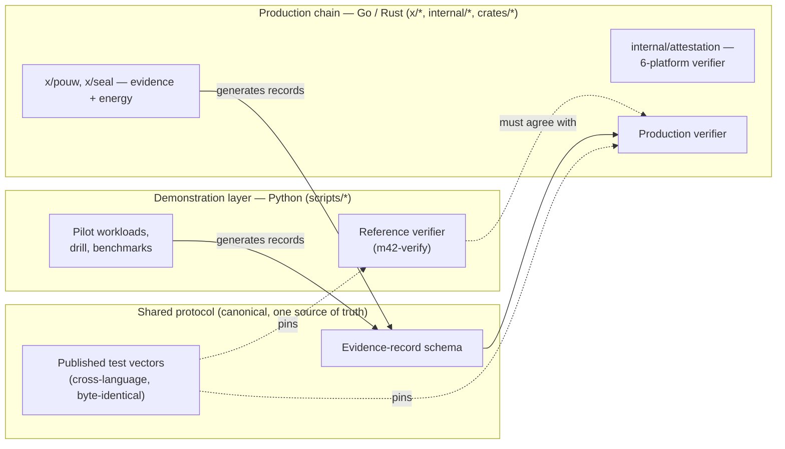

# M42 × Aethelred — Technical Due‑Diligence Annex

For M42's security, infrastructure, and clinical‑assurance reviewers. Every claim here is scoped in the **Claim Register** (companion doc); this annex adds mechanism detail and the evidence matrix. **There are no self‑assigned readiness scores** — only what is reproducible today vs. what a pilot dependency will establish.

---

## 1. Architecture truth: what is demonstration code, production code, and shared protocol

**The rule we are closing:** the production verifier (Go/Rust) must verify records generated by the demonstration layer, against one published test‑vector set. That removes any ambiguity about "which one is the product." *(Cross‑language byte‑identical evidence hashing is already demonstrated for the energy record; extending it to the full seal is a pre‑diligence task.)*

## 2. Evidence matrix

| Component | Evidenced today (reproducible) | Established during pilot (M42 dependency) |
|---|---|---|
| Evidence record + standalone verifier | Verifier reproduces all checks; adversarial matrix rejected | M42 engineer re‑runs the matrix in‑environment |
| Hardware attestation | 6 format adapters; real crypto vs a **test root**; policy engine (measurement/report‑data/vendor‑root) | Live **vendor‑collateral** validation + full acceptance protocol (§4) |
| Energy/cost | L1 device‑profile estimate; measured wall‑clock; cost from set factors | L2–L4 measured + PDU‑reconciled within agreed tolerance |
| Linear‑algebra verification (Freivalds) | Commit‑then‑challenge protocol; tamper rejected; ~8×10⁻⁵⁶/3 rounds | Integration into a real inference path on M42 hardware |
| Post‑quantum path | Hybrid Ed25519+XMSS, per‑batch‑root signing | Key‑rotation/multi‑tree + external crypto & KMS review |
| Scientific benchmark | ChEMBL EGFR held‑out AUROC 0.9621 (random split) | Scaffold/temporal split + specialist review; then real M42 workload |
| Data sovereignty | In‑boundary deployment design; batch‑root‑only anchoring | Verified against M42 DPIA/controls on governed data |

## 3. Mechanism notes (see Claim Register for exact wording & limits)

- **Evidence record:** binds model identity, IO commitments, policy, and attestation; one hybrid signature + one attestation per **batch**, per‑record Merkle inclusion. Standalone offline verification.
- **Attestation:** real parsing + signature + chain per platform. Hardware quotes (AMD SEV‑SNP, Intel TDX) are verified directly; issuer tokens (Azure MAA, GCP, NVIDIA) additionally require issuer‑policy evaluation. Production acceptance protocol enumerated in Claim Register §4 — including **binding the attested key to the seal signing key** and **replay protection**.
- **Freivalds:** verifies `Y = W·X` only; challenge is **Fiat‑Shamir over commitments to (W,X,Y) + a verifier nonce** (prover cannot predict); does not cover nonlinearities/preprocessing/semantics.
- **Energy:** four measurement levels (L1–L4); today L1 + measured wall‑clock; "job‑attributable energy within a defined boundary," not "every watt." Carbon factors are auditable and stamped with source/geography/time/method.
- **Post‑quantum:** signature integrity path; XMSS is stateful → production key‑management under review.

## 4. Workload strategy

| Stage | Workload | Rationale |
|---|---|---|
| **Day‑one technical gate** | An M42‑owned **non‑patient / low‑risk** inference job (e.g. a Med42 evaluation run or internal inference) | Proves deployment, live attestation, model/container provenance, cost + energy measurement, and independent verification **before** data‑governance approvals — so privacy sign‑off does not consume the pilot |
| **Flagship shadow validation** | **Digital pathology in shadow mode** | Connects to a current, publicly announced M42 operational AI priority; Aethelred is the **assurance layer around an existing clinical workflow**, not a competing model; final clinical decisions remain with clinicians. If third‑party model permissions block the specific deployment, use an M42‑owned pathology evaluation pipeline in an M42 environment with the same narrative |
| **Expansion** | **Genomics** | Strategically powerful but higher data‑governance friction → the production expansion story after assurance is proven on a lower‑friction workload |

## 5. Data protection posture (privacy‑by‑design, not just "de‑identified")

- Aethelred runs **within M42's environment**; M42 controls encryption and signing keys.
- Aethelred personnel **do not access raw patient data**; remote support receives only approved operational telemetry.
- **No patient‑level identifiers** in records; **no raw data or low‑entropy reversible hashes** on any public/shared ledger.
- Explicit retention/deletion periods; M42 can export and verify evidence **without continued Aethelred connectivity**.
- Phase‑0 delivery of a **DPIA support pack and processing‑role matrix**, mapped to the applicable UAE PDPL / ADGM / health‑data / Department of Health / ADHICS obligations. *(Regulatory mapping to be confirmed with M42 privacy/legal.)*

## 6. Pre‑diligence engineering checklist (seller‑controlled; close before M42 engineers inspect)

| # | Item | State |
|---|---|---|
| 1 | Push + off‑machine backup of the reviewed code | **Open** (deferred pending PR strategy) |
| 2 | Clean review PR + formal review | **Open** |
| 3 | Dependency / license / secrets / container scans | **Open** (tooling identified) |
| 4 | SBOM + remediation register | **Open** |
| 5 | Architecture‑truth diagram | **Done** (§1) |
| 6 | Production verifier checks demo artifacts | **Done** — Go stack (`internal/evidence`) verifies a Python‑generated evidence vector (Ed25519 batch signature + SHA‑256 record digest) and rejects tampering; `make m42-crossstack`, in CI. XMSS leg + full canonical‑form reproduction in Go remain deeper unification steps. |
| 7 | Claim register (claim/scope/evidence/hardware/limits/owner) | **Done** (companion doc) |
| 8 | Remove self‑scored readiness table from customer materials | **Done** (this package uses an evidence matrix) |
| 9 | Narrow PQC / Freivalds / energy / attestation / clinical claims | **Done** (Claim Register) |
| 10 | Choose one target platform + one target workload | **Recommended:** AMD SEV‑SNP + day‑one Med42/non‑patient, pathology shadow flagship |
| 11 | Data‑flow + DPIA support pack | **Open** (Phase‑0 deliverable drafted) |
| 12 | Adversarial demo run **by M42** (tamper → rejected) | **Ready** (`make m42-adversarial`); M42 re‑run is a Phase‑0/1 gate |

**Not required before the first meeting:** all six platforms on production silicon · full Python→Go/Rust unification · additional public datasets · a production UI · real M42 patient‑data validation · a full post‑quantum production migration.
