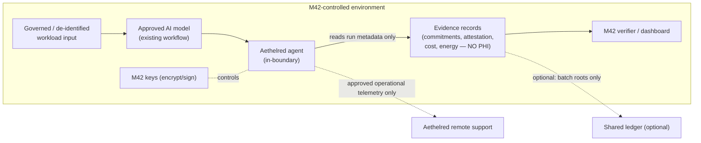

# DPIA Support Pack — M42 × Aethelred AI Compute Assurance Pilot

**Purpose.** This pack supports M42's Data Protection Officer in conducting a Data Protection Impact Assessment for the pilot. It is a **support document, not a legal opinion**: Aethelred is not M42's legal or privacy adviser, and every regulatory mapping below is **to be confirmed with M42 Legal/Privacy**. It is delivered in **Phase 0** per the Pilot SOW.

**Headline for the DPIA.** Aethelred is a **processor operating inside M42's environment** whose product is designed so that **raw patient data, model weights, and identifiable inputs never leave M42's control, and Aethelred personnel never access raw patient data.** The processing footprint is therefore **operational and evidence metadata**, not personal health information. This is a deliberately low‑privacy‑risk architecture.

---

## 1. Processing at a glance

| Question | Answer |
|---|---|
| **What is processed?** | Compute/operational telemetry and tamper‑evident **evidence records** (model identity, IO **commitments/hashes**, attestation, cost, energy). **No** patient‑level identifiers, **no** raw clinical inputs, **no** model weights in records. |
| **Whose data?** | For the day‑one workload: **no patient data** (M42‑owned non‑patient/low‑risk workload). For the shadow workload: **de‑identified / governed** data, processed **in‑place**; Aethelred sees only evidence metadata about the run, not the clinical content. |
| **Where?** | Entirely **within an M42‑controlled environment**. |
| **Who controls keys?** | **M42** controls encryption and signing keys. |
| **Automated decisions about individuals?** | **No.** Aethelred does not make or influence clinical decisions; it is an assurance layer around an existing workflow. Final clinical decisions remain with clinicians. |
| **Cross‑border transfer?** | **None by default.** No raw data or reversible low‑entropy hashes leave the environment; any optional shared‑ledger anchoring carries **batch roots only**. |

---

## 2. Roles and responsibilities (processing‑role matrix)

| Activity | M42 | Aethelred |
|---|---|---|
| Determines purpose & means of clinical processing | **Controller** | — |
| Owns and governs patient data | **Controller / data owner** | No access to raw data |
| Provides the compute environment | **Owner** | Deploys within it |
| Generates evidence records about executions | Approves | **Processor** (records = metadata, not PHI) |
| Holds encryption/signing keys | **Holds** | Uses within the environment; does not exfiltrate |
| Operates the standalone verifier | **Operates** | Provides tooling |
| Receives remote support telemetry | Approves fields | Receives **only approved operational telemetry** |
| Defines retention/deletion | **Defines** | Implements |
| Conducts the DPIA | **Owns** (DPO) | Supports (this pack) |

**Instrument:** the pilot runs under an MSA/SOW with **processor terms** agreed **before** any processing (data‑processing addendum, confidentiality, security schedule).

---

## 3. Data‑flow (privacy‑relevant view)

**Key point for the DPO:** the arrows that could carry personal data (`D → M → A`) stay **inside** the boundary; the arrows that leave (`→ S`, optional `→ L`) carry **only** approved operational telemetry and **batch roots**, never patient‑level data.

---

## 4. Necessity & proportionality

- **Necessity:** M42 needs independent assurance of where/what/cost/energy for AI workloads to support governance, sustainability reporting, and sovereign operation.
- **Proportionality:** achieved by design — the assurance is produced from **commitments and telemetry**, not from patient data. No additional collection of personal data is required beyond what the existing clinical workflow already processes.
- **Data minimisation:** evidence records contain hashes/commitments, not content; support telemetry is field‑restricted and inspected in Phase 0.

---

## 5. Risk register (privacy)

| # | Risk | Likelihood | Impact | Mitigation | Residual |
|---|---|---|---|---|---|
| 1 | Patient data leaves the boundary | Low | High | In‑boundary deployment; no raw data/weights in records; egress limited to approved telemetry + batch roots; Phase‑1 stop/go verifies this | Low |
| 2 | Re‑identification via low‑entropy hashes on a shared ledger | Low | High | No raw or low‑entropy reversible hashes leave the environment; only batch roots optionally anchored; anchoring off by default | Low |
| 3 | Aethelred personnel access raw data | Low | High | No‑access design; support receives only approved operational telemetry; access controls + audit | Low |
| 4 | Excessive telemetry collection | Medium | Medium | Field‑level allow‑list agreed and inspected in Phase 0; documented data dictionary | Low |
| 5 | Key compromise | Low | High | M42 holds keys; documented rotation approach; hardware key‑management for signing (under review) | Low–Med |
| 6 | Vendor lock‑in of evidence | Low | Medium | M42 can **export and verify evidence without continued Aethelred connectivity** | Low |
| 7 | Retention beyond need | Low | Medium | Explicit retention/deletion periods; deletion verification | Low |
| 8 | Sub‑processor exposure | Low | Medium | No sub‑processors handle personal data by default; any addition requires prior M42 approval | Low |

---

## 6. Privacy‑by‑design controls (commitments)

- Runs **within M42's environment**; **M42 controls encryption and signing keys**.
- Aethelred personnel **do not access raw patient data**; remote support receives **only approved operational telemetry**.
- **No patient‑level identifiers** in evidence records; **no raw data or reversible low‑entropy hashes** on any public/shared ledger.
- **Explicit retention and deletion** periods; deletion is verifiable.
- **M42 can export and independently verify evidence** without continued Aethelred connectivity.
- **Data dictionary** for every telemetry/evidence field, delivered and inspected in Phase 0.

---

## 7. Data‑subject rights & incident handling

- **Rights (access/rectification/erasure/objection):** because Aethelred processes no patient‑identifiable data, rights requests are served by M42 against the source systems; Aethelred assists by deleting any linked evidence records on M42 instruction.
- **Breach/incident:** documented notification path and timelines to M42; Aethelred supports investigation with evidence logs; roles defined in the security schedule.

---

## 8. Regulatory mapping (to be confirmed with M42 Legal/Privacy)

*Indicative only — Aethelred is not providing legal advice. M42's DPO confirms applicability and obligations.*

| Framework | Relevance | How the design supports it |
|---|---|---|
| **UAE PDPL** (Federal Decree‑Law 45/2021) | Personal‑data processing in the UAE | Processor terms pre‑processing; minimisation; in‑boundary processing; documented purposes |
| **ADGM Data Protection Regulations** | If processing falls within ADGM | DPIA support; processor obligations; transfer controls (none by default) |
| **UAE health‑data law / DoH standards** | Health‑data localisation & handling | Data stays in‑boundary; no health data in records; localisation preserved |
| **ADHICS** (Abu Dhabi Healthcare Information & Cyber Security) | Healthcare information security controls | Key custody with M42; access controls; audit; incident handling; security schedule |
| **M42 Group Data Protection Policy** | Contractor/third‑party processing; high‑risk health data; DPIA for high‑risk processing; vendor privacy terms before processing | This pack + processor terms + minimisation posture map directly to these expectations |

---

## 9. DPIA outcome section (for M42's DPO to complete)

- [ ] Processing description confirmed
- [ ] Roles (controller/processor) confirmed and processor terms executed
- [ ] Necessity & proportionality accepted
- [ ] Risk register reviewed; residual risks accepted or further mitigated
- [ ] Regulatory applicability confirmed by M42 Legal/Privacy
- [ ] Telemetry/evidence data dictionary approved
- [ ] Retention/deletion periods set
- [ ] Sign‑off: DPO / Security / Legal / Workload owner

---

*Companion documents: Executive Offer, Pilot SOW, Technical Annex (data‑flow & controls detail), Claim Register, Security Remediation Register.*
