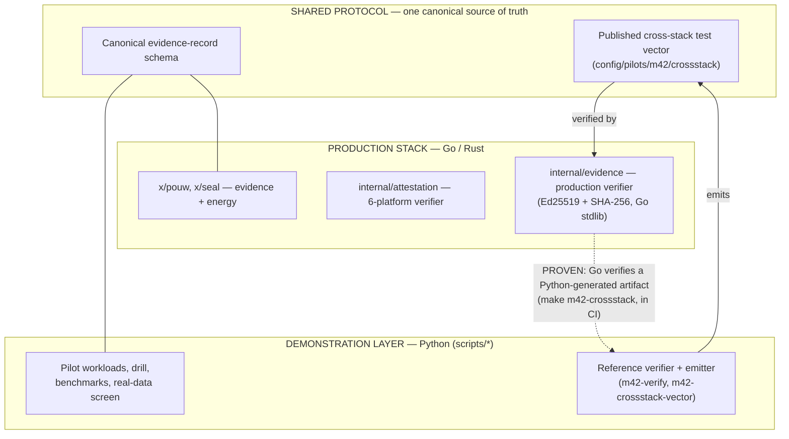

# Architecture Truth — One Page

What is **demonstration code**, what is **production code**, and what is the **shared protocol** that binds them. This exists to remove any ambiguity about "which one is the product."

## What each layer is for

| Layer | Language | Role | Status |
|---|---|---|---|
| **Demonstration** | Python (`scripts/`) | Runs the pilot workloads, produces evidence, benchmarks, and reference verification. **Fast to iterate; how M42 sees the pilot behave.** | Real, tested |
| **Production** | Go/Rust (`x/`, `internal/`, `crates/`) | The chain and verifiers that operate the assurance layer in production. | Real, tested |
| **Shared protocol** | — | One canonical evidence schema and a **published cross‑stack test vector**. | Pinned |

## The binding (already proven)

- The **cross‑stack test vector** is emitted by the Python demonstration layer and **independently verified by the Go production stack** (`internal/evidence`) using only the Go standard library: it re‑verifies the Ed25519 batch signature (RFC 8032) and re‑derives the SHA‑256 record digest, and **rejects tampering**. Run: `make m42-crossstack` (also in CI).
- The energy **WorkReceipt** hashes **byte‑for‑byte identically** across Python and Go.

## Remaining unification steps (disclosed)

- Extend Go verification to the **XMSS (post‑quantum) leg** and full canonical‑form reproduction (today Go verifies the classical leg + digest).
- Converge on a **single implementation** of the seal for production, with the Python layer retained only as a reference/demonstration harness.
