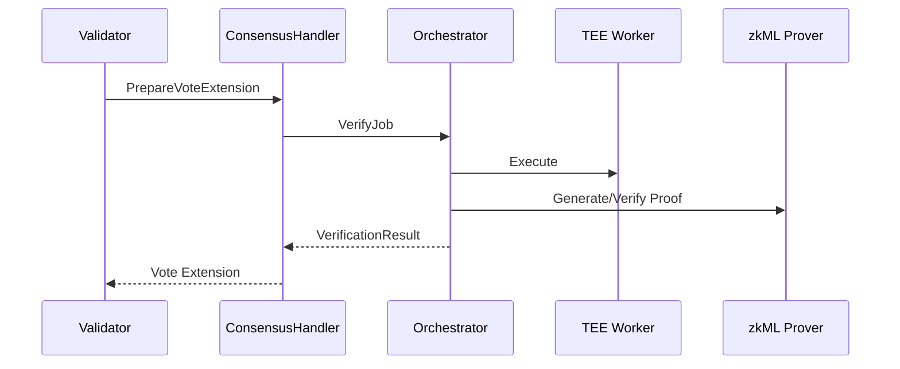

# Aethelred Architecture Specification

This document describes the **current implementation** of the Aethelred network, the core components in this repository, and the critical data flows. Where relevant, it calls out **planned** components that are referenced elsewhere but not yet implemented.

## 1. Scope and Goals

**Scope**
- The Cosmos SDK application (`app/`) that runs validator nodes.
- On-chain modules: `x/pouw`, `x/verify`, `x/seal`, `x/validator`, `x/demo`.
- Off-chain services used by the verification pipeline (TEE workers, zkML prover/verifier).
- Operations-facing endpoints (metrics, health, readiness).

**Goals**
- Deterministic and auditable verification of compute results.
- ABCI++ vote-extension based consensus inputs for verification.
- Clear trust boundaries between the chain and external verification services.
- Operational visibility and safety gates for production readiness.

## 2. System Overview

At a high level, Aethelred is a Cosmos SDK chain that integrates a Proof-of-Useful-Work (PoUW) pipeline with off-chain verification (TEE and zkML). The chain uses CometBFT for consensus and ABCI++ vote extensions to carry verification results into block consensus.

```mermaid
flowchart LR
  subgraph Clients
    SDK[SDKs / API clients]
  end

  subgraph Chain[Validator Node (Cosmos SDK + CometBFT)]
    App[AethelredApp]
    PoUW[x/pouw]
    Verify[x/verify]
    Seal[x/seal]
    Val[x/validator]
    Demo[x/demo]
  end

  subgraph OffChain[External Services]
    TEE[TEE Worker / Enclave]
    Prover[zkML Prover]
    Attest[Attestation Verifier]
  end

  SDK --> App
  App --> PoUW
  App --> Verify
  App --> Seal
  App --> Val

  PoUW --> Verify
  Verify --> TEE
  Verify --> Prover
  Verify --> Attest
```

## 3. On-Chain Components

### 3.1 Application Layer (`app/`)
- **AethelredApp** wires the Cosmos SDK base app, keepers, and modules.
- **ABCI++ integration** is implemented in `app/abci.go` with vote extensions.
- **Verification pipeline** is composed in `app/verification_pipeline.go`:
  - `VerificationOrchestrator` (x/verify)
  - Orchestrator bridge to PoUW’s `JobVerifier`
  - `ConsensusHandler` (x/pouw)
  - `EvidenceProcessor` (x/pouw)
- **Operational endpoints**:
  - `/metrics/aethelred` (Prometheus text format)
  - `/health/aethelred` (component-level health)

### 3.2 PoUW Module (`x/pouw`)
Responsible for job lifecycle, scheduling, consensus aggregation, and evidence.

Key responsibilities:
- **Compute Jobs**: submission, assignment, completion, and settlement.
- **Scheduler**: assigns jobs to validators (indexed scheduling pools).
- **Consensus Handler**: produces and aggregates verification vote extensions.
- **Evidence & Slashing**: detects invalid results or downtime evidence.
- **Metrics and Audit**: in-process metrics and structured audit logs.

Primary state:
- Jobs, pending jobs, registered models.
- Validator stats and capabilities.
- Module parameters.

### 3.3 Verify Module (`x/verify`)
Responsible for configuration and verification logic for external proof systems.

Key responsibilities:
- **Verification Orchestrator** (in `x/verify/orchestrator.go`):
  - Coordinates TEE execution and zkML proof verification.
  - Handles caching, timeouts, retries, and circuit breakers.
- **TEE configurations** and **verifying keys/circuits** are stored on-chain.
- **Readiness checks** ensure production configuration correctness.

### 3.4 Seal Module (`x/seal`)
Handles the creation and verification of seals (immutable verification records).

Key responsibilities:
- Seal creation, verification, and revocation.
- Indexed access by model/requester in the keeper.

### 3.5 Validator Module (`x/validator`)
Focuses on slashing integration and validator governance constraints.

### 3.6 Demo Module (`x/demo`)
Demonstration pipeline (credit scoring) used for end-to-end examples and testing.

## 4. Off-Chain Components

### 4.1 TEE Worker
- External service that executes model inference inside an enclave.
- Produces output + attestation data.
- Accessed via `app/tee_client.go` (HTTP interface).

### 4.2 zkML Prover/Verifier
- External service (EZKL-style) for zkML proof generation and verification.
- Configured via `AETHELRED_PROVER_ENDPOINT` and verify module params.

### 4.3 Attestation Verifier
- Optional external service for attestation validation.
- Configured via `AETHELRED_ATTESTATION_VERIFIER_ENDPOINT`.

## 5. Core Data Flows

### 5.1 Job Submission and Scheduling
1. Client submits a compute job to PoUW.
2. PoUW stores job state and assigns it via the scheduler.
3. Assigned validators execute verification for the job.

### 5.2 Verification Pipeline (TEE + zkML)
1. `ConsensusHandler` requests verification from the orchestrator bridge.
2. Orchestrator triggers TEE execution and/or zkML proof verification.
3. Results are returned as `VerificationResult` objects.

### 5.3 Vote Extensions and Consensus
1. Each validator emits vote extensions containing verification results.
2. The PoUW consensus handler aggregates results by job.
3. Consensus threshold is enforced (governance-configured, >= 67%).
4. Results are committed to state; evidence is collected for slashing.



### 5.4 Evidence and Slashing
- Evidence is recorded for invalid outputs or liveness failures.
- Slashing logic integrates with validator module parameters.

## 6. State and Parameters

Key parameter sets:
- PoUW module parameters (consensus thresholds, limits, fees).
- Verify module parameters (supported proof systems, allow_simulated, endpoints).
- Validator module parameters (slashing thresholds).

Key state collections:
- `x/pouw`: jobs, pending jobs, models, validator stats, params.
- `x/verify`: verifying keys, circuits, TEE configs, params.
- `x/seal`: seals and index structures.

## 7. Configuration and Feature Flags

Common environment variables:
- `AETHELRED_TEE_ENDPOINT`
- `AETHELRED_ATTESTATION_VERIFIER_ENDPOINT`
- `AETHELRED_PROVER_ENDPOINT`

Core flags:
- `AllowSimulated` (verify module params): enables simulated verification in dev/test.

## 8. Observability and Operations

**Metrics**
- `/metrics/aethelred` exposes module and orchestrator metrics.

**Health**
- `/health/aethelred` provides component-level health status:
  - PoUW module
  - Orchestrator
  - TEE client
  - Verify readiness
  - Circuit breakers

**Readiness**
- Startup readiness checks validate production configuration.

## 9. Trust Boundaries and Security Notes

Key trust boundaries:
- **Chain vs TEE/zkML services**: external services are treated as untrusted until verified.
- **Vote extensions**: only accepted if they pass validation and consensus thresholds.
- **Governance parameter updates**: must be validated and guarded against unsafe changes.

Security-critical invariants (enforced in code):
- Consensus threshold >= 67%.
- Verification failures are rejected (in production mode).
- Evidence is recorded for slashing-relevant events.

## 10. Deployment Topologies

Common node types:
- **Validator node**: runs the chain + verification pipeline.
- **Full node / RPC**: runs chain without validator keys.
- **TEE worker**: isolated enclave-backed service.
- **zkML prover/verifier**: GPU/CPU service with circuit cache.

## 11. ZK Proof System Support

The `x/verify` module supports multiple ZK proof systems through the `ZKVerifier` in
`x/verify/keeper/zk_verifier.go`. Each system has a dedicated verification method
that performs structural validation (minimum proof size, required fields) before
delegating to `cryptographicVerify()`.

| Proof System | Constant            | Min Proof Size | Status                          |
|-------------|---------------------|----------------|---------------------------------|
| EZKL        | `ProofSystemEZKL`   | 128 bytes      | Testnet (structural validation) |
| Groth16     | `ProofSystemGroth16`| 192 bytes      | Testnet (structural validation) |
| RISC0       | `ProofSystemRISC0`  | 512 bytes      | Testnet (structural validation) |
| Plonky2     | `ProofSystemPlonky2`| 256 bytes      | Testnet (structural validation) |
| Halo2       | `ProofSystemHalo2`  | 384 bytes      | Testnet (structural validation) |

**Testnet behavior**: All proof systems currently use structural validation only.
The `cryptographicVerify()` path checks for a registered system-specific verifier
and, if none is found, falls back to structural checks when `AllowSimulated` is
enabled. In production mode (`AllowSimulated=false`), the verifier fails closed
(ZK-09 security control).

**RISC0 scope note**: RISC0 (RISC Zero zkVM) is fully wired into the verification
pipeline -- including vote extensions, proof routing, gas estimation (4x multiplier),
genesis params, and the TEE client -- but does not yet have a production-grade
cryptographic verifier registered. Full RISC0 receipt verification (seal + claim
validation against an image ID) is scoped for post-testnet / mainnet readiness.
The same applies to all other proof systems listed above.

## 12. Planned or Referenced Components (Not Yet Implemented)

The README references additional layers (e.g., compliance module, expanded VM/precompiles, PQC features). These are **planned** but not fully represented in this codebase. When they land, this document should be updated with:
- Module ownership and storage layout.
- State transitions and invariants.
- API surface and operational dependencies.

## 13. Code Map

- Application wiring: `app/`
- PoUW module: `x/pouw/`
- Verification module: `x/verify/`
- Seal module: `x/seal/`
- Validator module: `x/validator/`
- Demo pipeline: `x/demo/`
- Rust services: `crates/`
- SDKs: `sdk/`

## 14. References

- `README.md`
- `docs/VALIDATOR_RUNBOOK.md`
