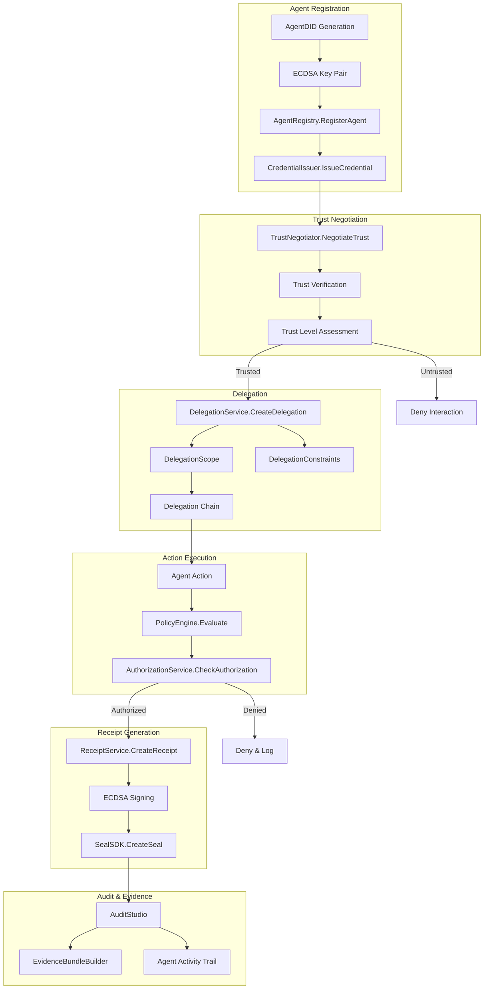

# Aethelred for Regulated Agent-to-Agent Systems

## Reference Architecture: Verified Identity, Delegated Authority, and Action Receipts

**Version:** 1.0  
**Last Updated:** April 2026  
**Classification:** Public -- Procurement-Ready

---

## 1. Overview

### Problem Statement

As enterprises deploy autonomous agent systems for procurement, customer service, compliance monitoring, and inter-organizational coordination, regulators require demonstrable control over agent actions. The EU AI Act mandates transparency and human oversight for high-risk AI; NIST AI RMF calls for documented governance across the agent lifecycle; and sector-specific requirements (financial dual-control, healthcare consent, defense classification) must apply to agent operations as they do to human ones. Without a trust protocol, agent-to-agent interactions are opaque, unaccountable, and unauditable.

### Solution Approach

Aethelred's Agent Trust Protocol (`pkg/protocol/agent`) provides a complete framework for regulated agent operations: DID-based verifiable identity, scoped delegation with depth limits, cryptographically signed action receipts, trust negotiation between agents, and policy enforcement at every step. Every agent action produces an immutable receipt that can be sealed to the Aethelred blockchain, creating an auditable chain of autonomous operations.

### Key Differentiators

- **DID-based agent identity**: `AgentDID` using the `did:aethelred` method provides verifiable, decentralized agent identification with ECDSA key pairs
- **Scoped delegation with depth limits**: `DelegationScope` constrains delegated authority by actions, resources, sectors, maximum depth (capped at `MaxDelegationDepth=5`), and time limits
- **Constraint-enforced delegation**: `DelegationConstraint` types include `max_amount`, `max_count`, `time_window`, and `ip_range` for fine-grained control
- **Cryptographic action receipts**: `ActionReceipt` records every agent action with actor DID, action, resource, result, delegation reference, and ECDSA signature
- **Trust negotiation**: `TrustNegotiator` enables agents to establish mutual trust levels before inter-agent operations

---

## 2. Architecture Diagram



---

## 3. Component Map

| Aethelred Package | Role in Architecture | Key Types |
|---|---|---|
| `pkg/protocol/agent` | Agent identity, delegation, receipts, trust negotiation | `AgentDID`, `DelegationScope`, `DelegationConstraint`, `ActionReceipt`, `TrustNegotiator`, `AgentRegistry`, `CredentialIssuer`, `AuthorizationService` |
| `pkg/seal/sdk` | Seal action receipts to blockchain | `SealSDK`, `RegulatoryConfig` |
| `pkg/governance/policy` | Policy enforcement on agent actions | `PolicyEngine`, `Decision`, sector-specific agent rules |
| `pkg/audit` | Audit Studio, evidence bundles | `AuditStudio`, `EvidenceBundleBuilder` |
| `pkg/compliance` | NIST AI RMF, EU AI Act mappings | Framework mappings for agent operations |
| `pkg/evidence` | Evidence portability | Cross-format export of agent activity evidence |

---

## 4. Data Flow

### 4.1 Agent Lifecycle

```
1. REGISTER        Agent registration with identity creation
                   ├── AgentDID generated: did:aethelred:<uuid>
                   ├── ECDSA key pair generated (P-256 curve)
                   ├── Public key registered with AgentRegistry
                   ├── Agent metadata recorded (capabilities, sector, owner)
                   └── CredentialIssuer.IssueCredential() provides verifiable credential

2. NEGOTIATE       Trust established between agents
                   ├── TrustNegotiator.NegotiateTrust() initiated
                   ├── Credentials exchanged and verified
                   ├── Trust level assessed (0.0 - 1.0)
                   ├── If trust threshold met: proceed to delegation
                   └── Trust negotiation result sealed

3. DELEGATE        Authority delegated with constraints
                   ├── DelegationService.CreateDelegation() invoked
                   ├── DelegationScope defines boundaries:
                   │   ├── Actions: list of permitted operations
                   │   ├── Resources: list of accessible resources
                   │   ├── Sectors: sector restrictions
                   │   ├── MaxDepth: re-delegation limit (max 5)
                   │   └── TimeLimit: delegation expiration
                   ├── DelegationConstraints applied:
                   │   ├── ConstraintMaxAmount: monetary limit
                   │   ├── ConstraintMaxCount: operation count limit
                   │   ├── ConstraintTimeWindow: execution time window
                   │   └── ConstraintIPRange: network location restriction
                   ├── Delegation signed by delegator
                   └── Delegation chain extended (parent reference)

4. EXECUTE         Agent performs delegated action
                   ├── AuthorizationService.CheckAuthorization() validates:
                   │   ├── Agent identity verified (DID + credential)
                   │   ├── Delegation chain validated (depth check)
                   │   ├── Scope check (action in permitted list)
                   │   ├── Constraint check (limits not exceeded)
                   │   └── Delegation not expired or revoked
                   ├── PolicyEngine.Evaluate() applies sector policies:
                   │   ├── Finance: dual-control for high-value operations
                   │   ├── Healthcare: consent check for patient data
                   │   ├── Defense: classification gate enforcement
                   │   └── General: rate limiting, resource quotas
                   └── Action executed if all checks pass

5. RECEIPT         ActionReceipt created for the action
                   ├── Receipt captures:
                   │   ├── ID: unique receipt identifier
                   │   ├── Actor: agent DID
                   │   ├── Action: operation performed
                   │   ├── Resource: target of the action
                   │   ├── Result: outcome (success/failure)
                   │   ├── Timestamp: execution time
                   │   ├── DelegationID: authorizing delegation
                   │   └── Evidence: key-value evidence data
                   ├── Receipt hash computed (SHA-256)
                   ├── ECDSA signature created with agent key
                   └── Receipt hash: SHA-256(ID+Actor+Action+Resource+Result+Timestamp+DelegationID)

6. SEAL            Receipt sealed to blockchain
                   ├── SealSDK.CreateSeal() with receipt content
                   ├── RegulatoryConfig specifies applicable frameworks
                   ├── Seal anchored to Aethelred blockchain
                   └── Seal ID recorded on receipt

7. AUDIT           Full audit trail maintained
                   ├── AuditStudio records all agent events
                   ├── Agent activity trail: registration, trust, delegation, execution, receipt
                   ├── Evidence bundle generated per compliance requirement
                   └── NIST AI RMF / EU AI Act evidence packages available
```

### 4.2 Multi-Hop Delegation

```
Agent A (Owner)
    │
    ├── Delegates to Agent B
    │   ├── Scope: {Actions: ["read", "analyze"], MaxDepth: 3}
    │   ├── Constraint: {MaxCount: 100, TimeWindow: 24h}
    │   └── Delegation depth: 1
    │
    ├── Agent B delegates to Agent C
    │   ├── Scope: {Actions: ["read"]}  (subset of B's scope)
    │   ├── MaxDepth decremented: 2
    │   └── Delegation depth: 2
    │
    └── Agent C delegates to Agent D
        ├── Scope: {Actions: ["read"]}  (cannot exceed C's scope)
        ├── MaxDepth decremented: 1
        └── Delegation depth: 3 (max reached, no further delegation)

Each hop:
- Delegation scope can only narrow (never widen)
- Constraints inherited and tightened
- Depth counter decremented
- Delegation chain cryptographically linked
- Full chain verifiable from any point
```

### 4.3 Delegation Revocation

```
1. Delegator calls DelegationService.RevokeDelegation()
2. Delegation marked as revoked with timestamp
3. All child delegations in chain also revoked (cascade)
4. Revocation event sealed to blockchain
5. AuthorizationService rejects actions under revoked delegations
6. In-flight actions completed but no new actions accepted
7. Revocation evidence bundle generated
```

---

## 5. Control Matrix

| Control Requirement | Framework | Aethelred Capability | Evidence Generated | Coverage |
|---|---|---|---|---|
| Agent identity | NIST AI RMF GOV | DID-based identity with ECDSA keys | Identity registration records | Full |
| Human oversight | EU AI Act Art. 14 | PolicyEngine approval workflows | Approval chain records | Full |
| Transparency | EU AI Act Art. 13 | Action receipts with full provenance | Receipt chain for any action | Full |
| Accountability | NIST AI RMF GOV | Sealed action receipts linked to agents | Immutable receipt trail | Full |
| Delegation limits | Enterprise governance | MaxDelegationDepth=5, scope narrowing | Delegation chain records | Full |
| Constraint enforcement | Sector-specific | Four constraint types on delegations | Constraint violation logs | Full |
| Trust establishment | NIST AI RMF MAP | TrustNegotiator with credential verification | Trust negotiation records | Full |
| Action auditing | NIST AI RMF MEASURE | AuditStudio with complete agent trail | Hash-chained audit log | Full |
| Revocation | Enterprise governance | Cascade revocation with sealed proof | Revocation event records | Full |
| Cross-sector compliance | Multi-framework | Sector-specific policy templates | Framework-specific evidence packages | Full |

---

## 6. Evidence Model

### 6.1 Per-Agent Evidence

| Evidence Artifact | Source | Content |
|---|---|---|
| Identity Registration | `AgentRegistry.RegisterAgent` | DID, public key, capabilities, owner |
| Verifiable Credential | `CredentialIssuer.IssueCredential` | Agent credential with issuer signature |
| Trust Negotiation | `TrustNegotiator.NegotiateTrust` | Trust level, verification results |

### 6.2 Per-Delegation Evidence

| Evidence Artifact | Source | Content |
|---|---|---|
| Delegation Record | `DelegationService.CreateDelegation` | Scope, constraints, chain reference |
| Delegation Chain | Chain traversal | Complete path from owner to delegate |
| Revocation Record | `DelegationService.RevokeDelegation` | Revocation time, cascade scope |

### 6.3 Per-Action Evidence

| Evidence Artifact | Source | Content |
|---|---|---|
| Action Receipt | `ReceiptService.CreateReceipt` | Actor, action, resource, result, delegation, signature |
| Receipt Seal | `SealSDK.CreateSeal` | Blockchain-anchored proof of receipt |
| Policy Decision | `PolicyEngine.Evaluate` | Decision type, rule match, sector context |

### 6.4 Action Receipt Structure

```json
{
  "id": "receipt-2026-04-09-001",
  "actor": "did:aethelred:agent-b-uuid",
  "action": "analyze_document",
  "resource": "document/contract-2026-q2",
  "result": "success",
  "timestamp": "2026-04-09T14:30:00Z",
  "delegation_id": "deleg-001",
  "evidence": {
    "input_hash": "sha256:a1b2c3...",
    "output_hash": "sha256:d4e5f6...",
    "model_version": "v2.1.0"
  },
  "signature": "3045022100..."
}
```

---

## 7. Deployment Guide

### 7.1 Prerequisites

- Aethelred node (v1.0+) with `x/seal` module enabled
- Go 1.21+ runtime
- Secure key storage for agent identity keys (HSM recommended for enterprise)
- Network connectivity between agents (direct or via broker)

### 7.2 Configuration

```go
import (
    "github.com/aethelred/aethelred/pkg/protocol/agent"
    "github.com/aethelred/aethelred/pkg/seal/sdk"
    "github.com/aethelred/aethelred/pkg/governance/policy"
)

// Initialize agent registry
registry := agent.NewAgentRegistry(agent.RegistryConfig{
    ValidateCredentials: true,
    MaxAgentsPerOwner:   100,
    RequireVerification: true,
})

// Register a new agent
agentDID, keyPair, err := registry.RegisterAgent(ctx, agent.RegistrationRequest{
    OwnerDID:     "did:aethelred:owner-uuid",
    DisplayName:  "procurement-agent-001",
    Capabilities: []string{"procurement", "analysis", "reporting"},
    Sector:       "finance",
})

// Configure delegation with constraints
delegation, err := agent.NewDelegationService(registry).CreateDelegation(ctx, agent.DelegationRequest{
    Delegator:   ownerDID,
    Delegate:    agentDID,
    Scope: agent.DelegationScope{
        Actions:   []string{"read", "analyze", "propose"},
        Resources: []string{"contracts/*", "vendors/*"},
        Sectors:   []string{"finance"},
        MaxDepth:  3,
        TimeLimit: 24 * time.Hour,
    },
    Constraints: []agent.DelegationConstraint{
        {Type: agent.ConstraintMaxAmount, Value: "50000"},
        {Type: agent.ConstraintMaxCount, Value: "100"},
        {Type: agent.ConstraintTimeWindow, Value: "09:00-17:00"},
    },
})

// Seal SDK for receipt anchoring
sealConfig := sdk.Config{
    NetworkEndpoint: "grpc://aethelred-node:9090",
    ChainID:         "aethelred-1",
    DefaultRegulatoryInfo: &sdk.RegulatoryConfig{
        ComplianceFrameworks: []string{"NIST-AI-RMF", "EU-AI-Act"},
        AuditRequired:        true,
    },
}
```

### 7.3 Deployment Topology

```
┌─────────────────────────────────────────────────────┐
│               Enterprise Agent Network               │
│                                                      │
│  ┌─────────┐  ┌─────────┐  ┌─────────┐             │
│  │ Agent A  │  │ Agent B  │  │ Agent C  │            │
│  │ (Owner)  │──│ (Deleg.) │──│ (Deleg.) │            │
│  │ DID:a001 │  │ DID:b002 │  │ DID:c003 │            │
│  └────┬─────┘  └────┬─────┘  └────┬─────┘            │
│       │              │              │                  │
│       └──────────────┼──────────────┘                  │
│                      │                                 │
│  ┌───────────────────▼──────────────────────────────┐ │
│  │ Aethelred Agent Trust Infrastructure             │ │
│  │ ┌──────────────┐ ┌──────────────┐               │ │
│  │ │ Agent        │ │ Delegation   │               │ │
│  │ │ Registry     │ │ Service      │               │ │
│  │ ├──────────────┤ ├──────────────┤               │ │
│  │ │ Trust        │ │ Authorization│               │ │
│  │ │ Negotiator   │ │ Service      │               │ │
│  │ ├──────────────┤ ├──────────────┤               │ │
│  │ │ Credential   │ │ Receipt      │               │ │
│  │ │ Issuer       │ │ Service      │               │ │
│  │ └──────────────┘ └──────────────┘               │ │
│  └───────────────────┬──────────────────────────────┘ │
│                      │                                 │
│  ┌───────────────────▼──────────────────────────────┐ │
│  │ Aethelred Validator Node (Seal Anchoring)        │ │
│  └──────────────────────────────────────────────────┘ │
└─────────────────────────────────────────────────────┘
```

### 7.4 Multi-Organization Deployment

- Each organization runs its own AgentRegistry for internal agents
- Cross-organization trust established via TrustNegotiator
- Delegations can span organizational boundaries with explicit trust
- Receipts verifiable by any party via blockchain seal
- Evidence bundles shareable for joint audit

---

## 8. Compliance Mapping

### 8.1 NIST AI RMF

| NIST AI RMF Function | Agent Trust Protocol Implementation |
|---|---|
| GOVERN 1.1 -- Policies | PolicyEngine enforces agent-specific rules |
| GOVERN 1.2 -- Accountability | DID identity links every action to an accountable agent |
| MAP 1.1 -- Intended Purpose | DelegationScope constrains agent purpose |
| MAP 3.1 -- AI Risks | Constraint enforcement limits delegation scope |
| MEASURE 2.1 -- Evaluation | Action receipts enable continuous evaluation |
| MEASURE 2.6 -- Monitoring | AuditStudio monitors agent activity |
| MANAGE 1.1 -- Risk Treatment | Delegation revocation, trust renegotiation |
| MANAGE 2.1 -- Response | Incident response for agent misbehavior |

### 8.2 EU AI Act

| EU AI Act Article | Agent Trust Protocol Implementation |
|---|---|
| Art. 9 -- Risk Management | Delegation constraints limit risk exposure |
| Art. 13 -- Transparency | Action receipts provide full transparency |
| Art. 14 -- Human Oversight | PolicyEngine RequireApproval for high-risk actions |
| Art. 15 -- Accuracy & Robustness | Trust negotiation verifies agent capabilities |
| Art. 26 -- Deployer Obligations | Complete audit trail for deployer accountability |
| Art. 43 -- Conformity Assessment | Evidence bundles for conformity body review |

---

## 9. Operational Considerations

### 9.1 Performance

- Agent registration: < 500ms (including key generation)
- Trust negotiation: < 2s (credential exchange and verification)
- Delegation creation: < 200ms
- Authorization check: < 50ms per action
- Receipt creation + signing: < 100ms
- Receipt sealing: < 2s (including blockchain anchor)

### 9.2 Scale

- Agents per registry: 100,000+
- Active delegations: 1,000,000+
- Receipts per day: 10,000,000+
- Delegation chain depth: max 5 hops
- Trust negotiations: 10,000+ per hour

### 9.3 Security

- Agent keys stored in HSM or secure element
- Delegation chains cryptographically linked and verifiable
- Receipt signatures non-repudiable (ECDSA)
- Compromised agent: revoke delegation, cascade to children
- Key rotation supported without identity change (DID stable)
