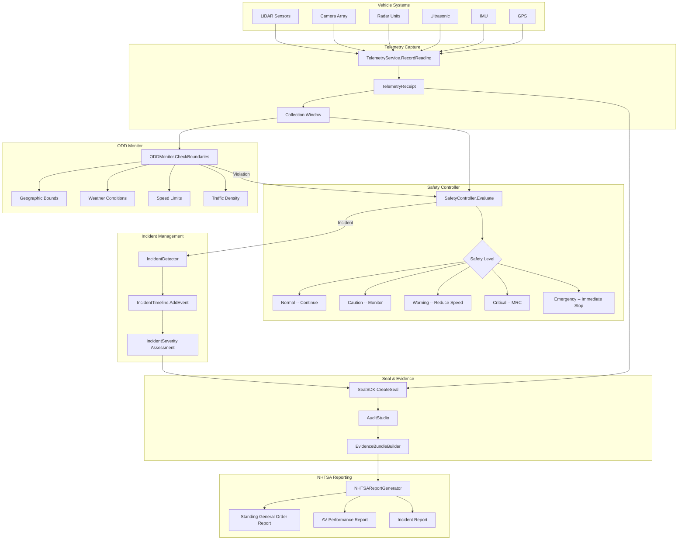

# Aethelred for Autonomous Mobility

## Reference Architecture: Telemetry Attestation, Safety Controls, and NHTSA Reporting

**Version:** 1.0  
**Last Updated:** April 2026  
**Classification:** Public -- Procurement-Ready

---

## 1. Overview

### Problem Statement

Autonomous vehicle operators face a convergence of safety and regulatory requirements: NHTSA's AV Framework demands transparent reporting on safety performance and incidents; ISO 26262 requires functional safety management with evidence of compliance; UNECE WP.29 mandates cybersecurity and software update management; and NIST AI RMF applies to the AI perception and decision systems at the core of autonomous driving. These requirements share a common need: tamper-evident, time-ordered evidence of every sensor reading, safety decision, and incident response.

### Solution Approach

Aethelred provides an autonomous mobility integrity layer via the AV integration package (`pkg/integrations/av`) that captures telemetry with cryptographic receipts, enforces safety controls through configurable safety levels, monitors operational design domain (ODD) boundaries, constructs signed incident timelines, and generates NHTSA-format reports. Every sensor reading, safety decision, and incident event is sealed and auditable.

### Key Differentiators

- **Telemetry receipts**: `TelemetryService` creates cryptographic receipts for sensor readings (LiDAR, Camera, Radar, Ultrasonic, IMU, GPS) with configurable collection windows
- **Safety level enforcement**: Five-tier safety model (Normal, Caution, Warning, Critical, Emergency) with configurable responses (Continue, ReduceSpeed, MinimalRiskCondition, ImmediateStop)
- **ODD monitoring**: `ODDMonitor` tracks operational design domain parameters with automatic safety escalation on boundary violations
- **Signed incident timelines**: `IncidentTimeline` with severity levels (Minor through Fatal) and 7 incident types including collision, near-miss, sensor failure, and ODD violation
- **NHTSA report generation**: Automated report generation per NHTSA Standing General Order and AV Framework requirements

---

## 2. Architecture Diagram



---

## 3. Component Map

| Aethelred Package | Role in Architecture | Key Types |
|---|---|---|
| `pkg/integrations/av` | Telemetry capture, safety controls, ODD monitoring, incident management, NHTSA reporting | `TelemetryService`, `SafetyController`, `ODDMonitor`, `IncidentTimeline`, `NHTSAReportGenerator` |
| `pkg/seal/sdk` | Digital Seal creation for telemetry and incident data | `SealSDK`, `RegulatoryConfig` |
| `pkg/governance/policy` | Safety policy evaluation | `PolicyEngine` with AV safety templates |
| `pkg/audit` | Audit Studio, evidence bundles | `AuditStudio`, `EvidenceBundleBuilder` |
| `pkg/compliance` | NIST AI RMF mappings for AV AI systems | Framework mappings |
| `pkg/operations/incident` | Incident response coordination | Incident workflows, escalation paths |
| `pkg/protocol/agent` | Agent identity for vehicle systems | `AgentDID` for vehicle identity attestation |

---

## 4. Data Flow

### 4.1 Telemetry Capture Lifecycle

```
1. SENSE           Sensor hardware produces readings
                   ├── SensorType: lidar | camera | radar | ultrasonic | imu | gps
                   ├── SensorReading captures:
                   │   ├── SensorID: hardware identifier
                   │   ├── Timestamp: capture time
                   │   ├── RawDataHash: SHA-256 of raw sensor data
                   │   ├── Confidence: sensor confidence score (0.0-1.0)
                   │   └── Status: sensor health status
                   └── Reading validated against sensor health thresholds

2. RECEIPT         TelemetryService.RecordReading() creates receipt
                   ├── TelemetryReceipt generated with:
                   │   ├── All sensor readings in collection window
                   │   ├── Aggregate hash over readings
                   │   ├── Vehicle state (position, velocity, heading)
                   │   └── Environmental conditions
                   └── Receipt signed with vehicle identity key

3. EVALUATE        SafetyController.Evaluate() assesses conditions
                   ├── Input: current telemetry receipt
                   ├── Safety rules applied (threshold-based)
                   ├── SafetyLevel determined: Normal | Caution | Warning | Critical | Emergency
                   ├── SafetyResponse selected: Continue | ReduceSpeed | MinimalRiskCondition | ImmediateStop
                   └── Safety decision logged

4. MONITOR         ODDMonitor.CheckBoundaries() validates ODD
                   ├── Geographic boundary check
                   ├── Weather condition assessment
                   ├── Speed limit compliance
                   ├── Traffic density evaluation
                   ├── Time-of-day restrictions
                   └── If ODD violation: escalate SafetyLevel

5. SEAL            SealSDK.CreateSeal() for telemetry batch
                   ├── Receipt content hash
                   ├── Safety evaluation results included
                   ├── ODD status included
                   ├── Regulatory config with AV frameworks
                   └── Seal anchored to blockchain

6. DETECT          IncidentDetector monitors for incidents
                   ├── IncidentType: collision | near_miss | sensor_failure | system_failure | odd_violation | safety_stop | kill_switch
                   ├── If incident detected: IncidentTimeline created
                   └── IncidentSeverity assessed: Minor | Moderate | Major | Critical | Fatal

7. TIMELINE        IncidentTimeline.AddEvent() builds timeline
                   ├── Pre-incident telemetry (configurable lookback)
                   ├── Incident trigger event
                   ├── Safety response actions
                   ├── Post-incident telemetry
                   └── All events sealed with timestamps

8. REPORT          NHTSAReportGenerator produces reports
                   ├── Standing General Order compliance report
                   ├── AV performance metrics report
                   ├── Incident detail report
                   └── All reports sealed and evidence-linked
```

### 4.2 Safety Escalation Flow

```
Normal ─────── Sensor readings within tolerance
  │             No ODD violations
  │             Continue operation
  │
Caution ────── Minor threshold exceedance
  │             Single sensor anomaly
  │             Increase monitoring frequency
  │
Warning ────── Multiple threshold exceedances
  │             ODD boundary approach
  │             Reduce speed, alert operator
  │
Critical ───── ODD violation detected
  │             Critical sensor failure
  │             Minimal Risk Condition (MRC) initiated
  │
Emergency ──── Imminent collision detected
                Multiple critical failures
                Immediate stop executed
                Kill switch activated
```

---

## 5. Control Matrix

| Control Requirement | Framework | Aethelred Capability | Evidence Generated | Coverage |
|---|---|---|---|---|
| Telemetry integrity | NHTSA AV Framework | Cryptographic telemetry receipts | Receipt hash, seal ID per batch | Full |
| Safety performance | NHTSA SGO | SafetyController with 5-tier model | Safety evaluation records | Full |
| ODD compliance | ISO 26262, UNECE WP.29 | ODDMonitor boundary checking | ODD compliance records, violation logs | Full |
| Incident recording | NHTSA SGO | IncidentTimeline with sealed events | Signed incident timeline | Full |
| Incident reporting | NHTSA SGO | NHTSAReportGenerator | NHTSA-format incident reports | Full |
| Functional safety | ISO 26262 | Safety levels mapped to ASIL | Safety evaluation evidence | Full |
| Cybersecurity | UNECE WP.29 R155 | Digital Seals, policy engine | Seal integrity, access control records | Full |
| Software update mgmt. | UNECE WP.29 R156 | Configuration management, seal versioning | Update records with integrity proof | Full |
| AI risk management | NIST AI RMF | Compliance framework mappings | Risk assessment evidence | Full |
| Data retention | NHTSA | Configurable retention per seal | Retention policy enforcement | Full |
| Sensor health monitoring | ISO 26262 | SensorReading.Status tracking | Sensor health logs, failure records | Full |
| Kill switch | Safety requirements | Emergency safety response | Kill switch activation records | Full |

---

## 6. Evidence Model

### 6.1 Per-Drive Evidence

| Evidence Artifact | Source | Frequency |
|---|---|---|
| Telemetry Receipt | `TelemetryService.RecordReading` | Per collection window (configurable, typically 1-10 seconds) |
| Safety Evaluation | `SafetyController.Evaluate` | Per telemetry receipt |
| ODD Status | `ODDMonitor.CheckBoundaries` | Continuous |
| Telemetry Seal | `SealSDK.CreateSeal` | Per batch (configurable) |

### 6.2 Per-Incident Evidence

| Evidence Artifact | Source | Content |
|---|---|---|
| Incident Timeline | `IncidentTimeline` | Time-ordered events with sealed telemetry |
| Severity Assessment | `IncidentSeverity` | Minor/Moderate/Major/Critical/Fatal classification |
| Pre-Incident Data | Telemetry lookback | Configurable window of pre-incident sensor data |
| Safety Response Record | `SafetyController` | Actions taken in response |
| NHTSA Report | `NHTSAReportGenerator` | Formatted for regulatory submission |

### 6.3 Telemetry Receipt Structure

```json
{
  "receipt_id": "tr-2026-04-09-14-30-00-001",
  "vehicle_id": "did:aethelred:vehicle-001",
  "timestamp": "2026-04-09T14:30:00.123Z",
  "collection_window_ms": 1000,
  "sensor_readings": [
    {
      "sensor_id": "lidar-front-01",
      "type": "lidar",
      "raw_data_hash": "sha256:a1b2c3...",
      "confidence": 0.98,
      "status": "nominal"
    },
    {
      "sensor_id": "camera-front-02",
      "type": "camera",
      "raw_data_hash": "sha256:d4e5f6...",
      "confidence": 0.95,
      "status": "nominal"
    }
  ],
  "aggregate_hash": "sha256:g7h8i9...",
  "safety_level": "Normal",
  "odd_status": "within_bounds",
  "seal_id": "seal-av-2026-04-09-001"
}
```

---

## 7. Deployment Guide

### 7.1 Prerequisites

- Vehicle compute platform (NVIDIA DRIVE, Qualcomm Ride, or equivalent)
- Aethelred node (v1.0+) -- can run on vehicle or connect to fleet server
- Go 1.21+ runtime
- Secure element or TPM for vehicle identity keys
- Cellular/satellite connectivity for seal anchoring (or deferred sync)

### 7.2 Configuration

```go
import (
    "github.com/aethelred/aethelred/pkg/integrations/av"
    "github.com/aethelred/aethelred/pkg/seal/sdk"
)

// Telemetry service configuration
telemetryConfig := av.TelemetryConfig{
    CollectionWindowMs:  1000,    // 1-second collection windows
    SealBatchSize:       60,      // Seal every 60 receipts (1 minute)
    RetainRawData:       true,
    SensorTypes:         []av.SensorType{
        av.SensorLiDAR,
        av.SensorCamera,
        av.SensorRadar,
        av.SensorUltrasonic,
        av.SensorIMU,
        av.SensorGPS,
    },
}

// Safety controller configuration
safetyConfig := av.SafetyConfig{
    DefaultLevel:     av.SafetyNormal,
    EscalationPolicy: av.EscalateOnAnyAnomaly,
    MRCTimeout:       30 * time.Second,
    KillSwitchArmed:  true,
}

// ODD boundaries
oddConfig := av.ODDConfig{
    GeographicBounds:  oddGeofence, // GeoJSON polygon
    MaxSpeed:          65.0,        // mph
    MinVisibility:     200.0,       // meters
    MaxWindSpeed:      45.0,        // mph
    AllowedTimeRange:  "06:00-22:00",
    MaxTrafficDensity: 80,          // vehicles per lane-mile
}

// Seal SDK for AV
sealConfig := sdk.Config{
    NetworkEndpoint: "grpc://fleet-server:9090",
    ChainID:         "aethelred-1",
    SignerAddress:    "aethelred1av...",
    DefaultRegulatoryInfo: &sdk.RegulatoryConfig{
        ComplianceFrameworks: []string{"NHTSA-AV", "ISO-26262", "UNECE-WP29"},
        RetentionPeriodDays:  1825, // 5 years
        AuditRequired:        true,
    },
}
```

### 7.3 Deployment Topology

```
┌─────────────────────────────────────────────────┐
│                  Vehicle                         │
│                                                  │
│  ┌────────────────────────────────────────────┐  │
│  │ Sensor Array                                │  │
│  │ LiDAR | Camera | Radar | Ultrasonic | IMU  │  │
│  └──────────────────┬─────────────────────────┘  │
│                     │                             │
│  ┌──────────────────▼─────────────────────────┐  │
│  │ Aethelred AV Module                         │  │
│  │ ┌──────────────────────────────────────┐    │  │
│  │ │ Telemetry Service                    │    │  │
│  │ │ Safety Controller                    │    │  │
│  │ │ ODD Monitor                          │    │  │
│  │ │ Incident Detector                    │    │  │
│  │ │ Local Seal Cache                     │    │  │
│  │ └──────────────────────────────────────┘    │  │
│  └──────────────────┬─────────────────────────┘  │
│                     │ (Cellular/Satellite)        │
└─────────────────────┼────────────────────────────┘
                      │
┌─────────────────────▼────────────────────────────┐
│              Fleet Server                         │
│  ┌──────────────────────────────────────────┐    │
│  │ Aethelred Validator Node                 │    │
│  │ Seal Anchoring Service                   │    │
│  │ NHTSA Report Generator                   │    │
│  │ Audit Studio                             │    │
│  │ Evidence Bundle Builder                  │    │
│  └──────────────────────────────────────────┘    │
└──────────────────────────────────────────────────┘
```

### 7.4 Offline Operation

- Vehicle operates with local seal cache when connectivity unavailable
- Telemetry receipts queued locally with tamper-evident storage
- Seals created locally and queued for blockchain anchoring
- On reconnection: queued seals batch-anchored to blockchain
- Incident timelines prioritized for immediate sync

---

## 8. Compliance Mapping

### 8.1 NHTSA AV Framework

| NHTSA Requirement | Aethelred Implementation |
|---|---|
| Operational Design Domain | ODDMonitor with configurable geographic, weather, speed, and traffic boundaries |
| Object and Event Detection | Telemetry receipts with sensor-level confidence scores |
| Fallback (MRC) | SafetyController MinimalRiskCondition response with automated execution |
| Crashworthiness | Incident timeline with pre/during/post-crash telemetry |
| Post-Crash AV Behavior | Safety response records, kill switch activation logs |
| Data Recording | Complete telemetry with cryptographic receipts |
| Consumer Education | N/A (organizational responsibility) |
| Federal/State/Local Laws | ODD boundaries enforced per jurisdiction |

### 8.2 NHTSA Standing General Order

| SGO Requirement | Aethelred Implementation |
|---|---|
| Incident reporting (crashes) | NHTSAReportGenerator with IncidentTimeline |
| 10-day reporting window | Automated report generation on incident detection |
| Monthly reporting | Scheduled report generation for fleet metrics |
| Pre-crash telemetry | Configurable lookback window in IncidentTimeline |
| ADS engagement status | ODD compliance records |

### 8.3 ISO 26262

| ISO 26262 Part | Aethelred Implementation |
|---|---|
| Part 3: Concept Phase | Risk assessment via compliance framework mappings |
| Part 4: Product Development | Safety controller with ASIL-mapped safety levels |
| Part 5: Hardware Level | Sensor health monitoring via SensorReading.Status |
| Part 6: Software Level | Sealed software configuration, integrity verification |
| Part 8: Safety Analysis | Incident analysis with evidence bundles |
| Part 9: ASIL Decomposition | Safety level decomposition in policy rules |

### 8.4 UNECE WP.29

| Regulation | Aethelred Implementation |
|---|---|
| R155 -- Cybersecurity | Digital Seals, access control, integrity monitoring |
| R156 -- Software Updates | Configuration management with sealed update records |
| R157 -- Automated Lane Keeping | ODD enforcement, safety controller |

---

## 9. Operational Considerations

### 9.1 Performance (Vehicle-Side)

- Telemetry receipt creation: < 5ms per collection window
- Safety evaluation: < 10ms (safety-critical path)
- ODD check: < 5ms
- Local seal creation: < 50ms
- Total latency budget: < 100ms from sensor to safety decision

### 9.2 Data Volume

- Per vehicle per hour: approximately 3.6 GB raw telemetry, approximately 3,600 telemetry receipts
- Seal storage: approximately 500 bytes per seal (approximately 60 seals/hour)
- Incident timeline: approximately 50 KB per incident (including pre-incident lookback)
- Fleet of 1,000 vehicles: approximately 86.4 million receipts/day

### 9.3 Connectivity Requirements

- Cellular preferred for real-time seal anchoring
- Satellite fallback for remote operation areas
- Full offline capability with local seal cache
- Minimum sync frequency: once per 24 hours for regulatory compliance
- Incident data prioritized for immediate sync
