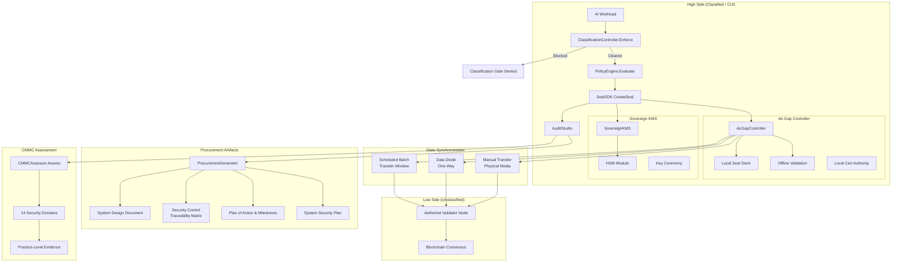

# Aethelred for Defense & Intelligence

## Reference Architecture: Air-Gapped Deployment, CMMC Compliance, and Procurement Artifacts

**Version:** 1.0  
**Last Updated:** April 2026  
**Classification:** Public -- Procurement-Ready

---

## 1. Overview

### Problem Statement

Defense and intelligence organizations deploying AI systems must satisfy CMMC 2.0 Level 2/3 requirements across 14 security domains, operate in air-gapped or classification-enforced environments, manage controlled unclassified information (CUI) with NIST 800-171 controls, meet FedRAMP authorization boundaries, and produce procurement artifacts (SSP, POA&M, SCTM) that satisfy DISA and C3PAO assessors. The intersection of these requirements with autonomous AI operations creates a unique deployment challenge that demands purpose-built infrastructure.

### Solution Approach

Aethelred provides a defense-grade deployment model via the defense integration package (`pkg/integrations/defense`) with air-gapped operation support, CMMC practice-level compliance assessment, classification enforcement gates, and automated procurement artifact generation. The system operates fully offline using local seal validation and state synchronization via manual, data diode, or scheduled batch modes.

### Key Differentiators

- **Air-gapped operation**: `AirGapController` supports three state sync modes (Manual, DataDiode, Scheduled) with offline seal validation and local certificate authority
- **CMMC 2.0 Level 2/3 assessment**: `CMMCAssessor` evaluates all 14 security domains with practice-level evidence mapping
- **Classification enforcement**: `ClassificationController` gates data flow based on classification levels with mandatory marking
- **Automated procurement artifacts**: `ProcurementGenerator` produces SSP, POA&M, SCTM, and SDD artifacts per NIST 800-171/CMMC requirements
- **Sovereign KMS**: `SovereignKMS` with HSM integration, key ceremony support, and offline key generation

---

## 2. Architecture Diagram



---

## 3. Component Map

| Aethelred Package | Role in Architecture | Key Types |
|---|---|---|
| `pkg/integrations/defense` | Air-gap controller, CMMC assessment, classification, procurement | `AirGapController`, `CMMCAssessor`, `ClassificationController`, `ProcurementGenerator`, `SovereignKMS` |
| `pkg/seal/sdk` | Digital Seal creation with offline validation | `SealSDK`, `RegulatoryConfig` |
| `pkg/governance/policy` | Defense-sector policy evaluation | `PolicyEngine` with defense templates |
| `pkg/audit` | Audit Studio, evidence bundles, OSCAL export | `AuditStudio`, `EvidenceBundleBuilder` |
| `pkg/compliance/frameworks` | CMMC 2.0 control library | CMMC framework definition, NIST 800-171 mappings |
| `pkg/deploy/sovereign` | Sovereign deployment configuration | Air-gap mode, data residency, enclave configuration |
| `pkg/evidence` | Evidence portability for assessors | Cross-format export, chain of custody |

---

## 4. Data Flow

### 4.1 Air-Gapped Operation Lifecycle

```
1. OPERATE         AI workload executes within high-side boundary
                   ├── All operations within air-gapped enclave
                   ├── No outbound network connectivity
                   ├── Local Cert Authority for internal TLS
                   └── Offline validation for all seal operations

2. CLASSIFY        ClassificationController.Enforce() gates data
                   ├── Classification levels: UNCLASSIFIED, CUI, SECRET, TOP_SECRET
                   ├── Mandatory marking on all data objects
                   ├── Cross-domain flow blocked by default
                   ├── Downgrade requires explicit approval chain
                   └── Classification decision logged to audit trail

3. EVALUATE        PolicyEngine.Evaluate() with defense templates
                   ├── Need-to-know enforcement
                   ├── Compartment access validation
                   ├── RequireDualControl for classification changes
                   └── Break-glass with mandatory justification

4. SEAL            SealSDK.CreateSeal() in offline mode
                   ├── Signing via SovereignKMS with HSM
                   ├── Seal stored in local seal store
                   ├── Offline validation against local trust anchor
                   └── Seal queued for eventual blockchain anchor

5. SYNC            State synchronization to low side
                   ├── StateSyncManual: physical media transfer
                   │   ├── State snapshot exported to removable media
                   │   ├── SHA-256 manifest for integrity verification
                   │   ├── Snapshot age validated (MaxSnapshotAge)
                   │   └── Physical custody chain documented
                   ├── StateSyncDiode: one-way data diode
                   │   ├── Seal anchoring data transmitted one-way
                   │   ├── No return path (diode enforced)
                   │   └── Transmission receipt generated
                   └── StateSyncScheduled: batch transfer window
                       ├── Transfer during scheduled maintenance window
                       ├── Differential sync for efficiency
                       └── Transfer log with integrity verification

6. ANCHOR          Seal data anchored on low-side blockchain
                   ├── Validator node processes queued seals
                   ├── Consensus reached among validator set
                   └── Anchor confirmation queued for next sync

7. ASSESS          CMMCAssessor evaluates compliance posture
                   ├── 14 security domains assessed
                   ├── Practice-level evidence mapped
                   ├── Coverage: Full | Partial | Planned | Gap
                   └── Assessment report generated
```

### 4.2 Procurement Artifact Generation

```
1. CMMCAssessor.Assess() produces domain-level assessment
2. ProcurementGenerator initializes with assessment results
3. Artifact generation:
   ├── SSP (System Security Plan)
   │   ├── System boundary description
   │   ├── Control implementation statements
   │   ├── Evidence references per control
   │   └── Interconnection descriptions
   ├── POA&M (Plan of Action & Milestones)
   │   ├── Open findings with severity
   │   ├── Remediation timelines
   │   ├── Resource assignments
   │   └── Milestone tracking
   ├── SCTM (Security Control Traceability Matrix)
   │   ├── NIST 800-171 control → implementation mapping
   │   ├── Evidence references per control
   │   ├── Coverage status
   │   └── Test procedure references
   └── SDD (System Design Document)
       ├── Architecture diagrams
       ├── Data flow descriptions
       ├── Security boundary definitions
       └── Component inventory
4. All artifacts sealed for integrity
5. Artifacts packaged for C3PAO or DISA review
```

---

## 5. Control Matrix

| Control Requirement | Framework | Aethelred Capability | Evidence Generated | Coverage |
|---|---|---|---|---|
| Access Control (AC) | CMMC, NIST 800-171 | PolicyEngine role-based evaluation, classification gates | Access control decision records | Full |
| Audit & Accountability (AU) | CMMC, NIST 800-171 | AuditStudio with hash chain integrity | Immutable audit log, evidence bundles | Full |
| Configuration Management (CM) | CMMC, NIST 800-171 | Policy versioning, system state snapshots | Configuration change records | Full |
| Identification & Authentication (IA) | CMMC, NIST 800-171 | DID-based agent identity, SovereignKMS | Identity attestation, key management records | Full |
| Incident Response (IR) | CMMC, NIST 800-171 | Incident response workflows | Incident timeline, evidence packages | Full |
| Media Protection (MP) | CMMC, NIST 800-171 | Classification enforcement, state sync controls | Media transfer logs, integrity verification | Full |
| Physical Protection (PE) | CMMC, NIST 800-171 | Air-gap enforcement, physical media controls | Physical access logs (organizational) | Partial |
| Risk Assessment (RA) | CMMC, NIST 800-171 | Compliance framework mappings, coverage assessments | Risk assessment reports | Full |
| Security Assessment (CA) | CMMC, NIST 800-171 | CMMCAssessor continuous assessment | Assessment reports with evidence | Full |
| System & Comm. Protection (SC) | CMMC, NIST 800-171 | Air-gap controller, local CA, SovereignKMS | Network isolation evidence, crypto config | Full |
| System & Info. Integrity (SI) | CMMC, NIST 800-171 | Digital Seals, hash chain integrity | Seal verification, integrity reports | Full |
| ITAR compliance | ITAR | Classification enforcement, jurisdiction restrictions | Classification decision records, export control evidence | Full |
| FedRAMP boundary | FedRAMP | Sovereign deployment boundaries | Boundary definition, interconnection evidence | Full |
| CUI marking | NIST 800-171 | Mandatory classification marking | Marking records, classification gate logs | Full |

---

## 6. Evidence Model

### 6.1 CMMC Assessment Evidence

| CMMC Domain | Practice Count (L2) | Aethelred Evidence |
|---|---|---|
| Access Control (AC) | 22 | Policy decisions, role assignments, access logs |
| Awareness & Training (AT) | 3 | Training records (organizational), policy acknowledgments |
| Audit & Accountability (AU) | 9 | Hash-chained audit log, evidence bundles, retention proof |
| Configuration Management (CM) | 9 | State snapshots, change records, baseline comparisons |
| Identification & Authentication (IA) | 11 | DID registrations, key management records, auth logs |
| Incident Response (IR) | 3 | Incident timelines, evidence packages, notification records |
| Maintenance (MA) | 6 | Maintenance logs, remote access records |
| Media Protection (MP) | 4 | Transfer logs, sanitization records, marking evidence |
| Personnel Security (PS) | 2 | Access provisioning/deprovisioning records |
| Physical Protection (PE) | 6 | Physical access logs (organizational supplement) |
| Risk Assessment (RA) | 4 | Assessment reports, vulnerability scans, coverage analysis |
| Security Assessment (CA) | 4 | Continuous assessment results, POA&M status |
| System & Comm. Protection (SC) | 16 | Network config, crypto settings, boundary evidence |
| System & Info. Integrity (SI) | 7 | Integrity verification, flaw remediation, monitoring logs |

### 6.2 Procurement Artifact Structure

```
procurement-package/
├── SSP-v1.0.json              # System Security Plan
│   ├── system_boundary
│   ├── control_implementations[]
│   ├── evidence_references[]
│   └── interconnections[]
├── POAM-v1.0.json             # Plan of Action & Milestones  
│   ├── findings[]
│   ├── milestones[]
│   └── resource_assignments[]
├── SCTM-v1.0.json             # Security Control Traceability Matrix
│   ├── control_mappings[]
│   ├── test_procedures[]
│   └── evidence_links[]
├── SDD-v1.0.json              # System Design Document
│   ├── architecture
│   ├── data_flows
│   └── component_inventory
├── evidence-bundle.json        # Supporting evidence
└── package-seal.json           # Seal over entire package
```

---

## 7. Deployment Guide

### 7.1 Prerequisites

- Air-gapped infrastructure with physical access controls
- FIPS 140-2 Level 3 (or higher) HSM for key management
- Go 1.21+ runtime (pre-installed on air-gapped systems)
- Aethelred node binaries pre-packaged for offline installation
- Physical media for state synchronization (if using manual sync mode)

### 7.2 Configuration

```go
import (
    "github.com/aethelred/aethelred/pkg/integrations/defense"
    "github.com/aethelred/aethelred/pkg/seal/sdk"
    "github.com/aethelred/aethelred/pkg/governance/policy"
)

// Air-gap configuration
airGapConfig := defense.AirGapConfig{
    DisableExternalNetwork: true,
    LocalCertAuthority:     "/etc/aethelred/ca/local-ca.pem",
    OfflineValidation:      true,
    StateSyncMode:          defense.StateSyncDiode,
    SnapshotInterval:       6 * time.Hour,
    MaxSnapshotAge:         24 * time.Hour,
}

// Sovereign KMS configuration
kmsConfig := defense.SovereignKMSConfig{
    HSMProvider:    "pkcs11",
    HSMLibPath:     "/usr/lib/softhsm/libsofthsm2.so",
    HSMSlotID:      0,
    KeyAlgorithm:   "ECDSA-P384",
    KeyCeremony:    true,
    OfflineKeyGen:  true,
}

// Seal SDK for defense deployment
sealConfig := sdk.Config{
    NetworkEndpoint: "grpc://localhost:9090", // local node only
    ChainID:         "aethelred-defense-1",
    SignerAddress:    "aethelred1def...",
    DefaultRegulatoryInfo: &sdk.RegulatoryConfig{
        DataClassification:       "CUI",
        ComplianceFrameworks:     []string{"CMMC-L2", "NIST-800-171", "FedRAMP"},
        JurisdictionRestrictions: []string{"US"},
        RetentionPeriodDays:      2555, // 7 years DoD requirement
        AuditRequired:            true,
    },
}

// Classification enforcement
classConfig := defense.ClassificationConfig{
    DefaultLevel:        defense.ClassCUI,
    EnforceMarking:      true,
    BlockCrossDomain:    true,
    DowngradeApproval:   defense.RequireDualControl,
}
```

### 7.3 Deployment Topology

```
┌─────────────────────────────────────────────────────┐
│                  HIGH SIDE (CUI/SECRET)              │
│                                                      │
│  ┌────────────┐  ┌──────────────────────────────┐   │
│  │ AI         │  │ Aethelred Application         │   │
│  │ Workload   │──│ ┌──────────────────────────┐  │   │
│  └────────────┘  │ │ Air-Gap Controller       │  │   │
│                  │ │ Classification Controller │  │   │
│  ┌────────────┐  │ │ Policy Engine             │  │   │
│  │ HSM (FIPS  │  │ │ CMMC Assessor            │  │   │
│  │ 140-2 L3)  │──│ │ Procurement Generator    │  │   │
│  └────────────┘  │ │ Audit Studio             │  │   │
│                  │ └──────────────────────────┘  │   │
│  ┌────────────┐  └──────────┬───────────────────┘   │
│  │ Local      │             │                        │
│  │ Validator  │─────────────┘                        │
│  │ Node       │                                      │
│  └────────────┘                                      │
│         │                                            │
│    ─────┼────── AIR GAP ──────────────────           │
│         │                                            │
│  ┌──────▼──────┐  (Data Diode / Manual / Scheduled)  │
│  │ State Sync  │                                     │
│  │ Transfer    │                                     │
│  └──────┬──────┘                                     │
└─────────┼───────────────────────────────────────────┘
          │
┌─────────▼───────────────────────────────────────────┐
│                  LOW SIDE (Unclassified)              │
│                                                      │
│  ┌────────────────────────┐                          │
│  │ Aethelred Validator    │                          │
│  │ Network (Consensus)    │                          │
│  └────────────────────────┘                          │
└─────────────────────────────────────────────────────┘
```

### 7.4 Key Ceremony Procedure

1. Two key custodians present (dual control)
2. HSM initialized in FIPS mode
3. Master key generated within HSM (never exported)
4. Signing keys derived from master key
5. Key ceremony witnessed and recorded
6. Ceremony evidence sealed and stored
7. Backup key shares distributed to custodians (Shamir secret sharing)

---

## 8. Compliance Mapping

### 8.1 CMMC 2.0 Level 2

| CMMC Domain | Key Practices | Aethelred Implementation |
|---|---|---|
| AC -- Access Control | AC.L2-3.1.1 through AC.L2-3.1.22 | PolicyEngine with role-based, attribute-based, and classification-based access control |
| AU -- Audit & Accountability | AU.L2-3.3.1 through AU.L2-3.3.9 | AuditStudio with hash chain, configurable retention, tamper detection |
| CM -- Configuration Mgmt. | CM.L2-3.4.1 through CM.L2-3.4.9 | State snapshots, configuration baselines, change tracking |
| IA -- Identification & Auth. | IA.L2-3.5.1 through IA.L2-3.5.11 | DID-based identity, SovereignKMS, multi-factor attestation |
| SC -- System & Comm. Protection | SC.L2-3.13.1 through SC.L2-3.13.16 | Air-gap enforcement, local CA, encrypted channels |
| SI -- System & Info. Integrity | SI.L2-3.14.1 through SI.L2-3.14.7 | Digital Seals, continuous integrity monitoring |

### 8.2 NIST SP 800-171 Rev. 2

| NIST 800-171 Family | Aethelred Implementation |
|---|---|
| 3.1 Access Control | PolicyEngine, ClassificationController |
| 3.3 Audit & Accountability | AuditStudio, hash-chained audit log |
| 3.4 Configuration Management | State snapshots, version tracking |
| 3.5 Identification & Authentication | Agent DID, SovereignKMS |
| 3.11 Risk Assessment | CMMCAssessor, compliance framework mappings |
| 3.12 Security Assessment | Continuous assessment, POA&M generation |
| 3.13 System & Comm. Protection | Air-gap controller, local CA |
| 3.14 System & Info. Integrity | Digital Seals, integrity verification |

### 8.3 FedRAMP

| FedRAMP Requirement | Aethelred Implementation |
|---|---|
| Authorization boundary | Sovereign deployment boundary enforcement |
| Continuous monitoring | AuditStudio continuous integrity checks |
| Incident response | Incident response workflows with evidence |
| Supply chain risk | Provenance chain for all components |
| POA&M management | ProcurementGenerator POA&M artifacts |

---

## 9. Operational Considerations

### 9.1 Air-Gap State Sync Timing

| Sync Mode | Latency | Bandwidth | Security |
|---|---|---|---|
| Manual | Hours-days | Limited by media size | Highest (physical custody) |
| Data Diode | Seconds-minutes | Medium (diode capacity) | High (one-way enforced) |
| Scheduled | Hours (batch window) | High (full differential) | High (controlled window) |

### 9.2 Performance (Air-Gapped)

- Offline seal creation: < 2s (HSM-backed signing)
- Offline seal verification: < 100ms (local trust anchor)
- CMMC assessment (full): < 60s for all 14 domains
- Procurement artifact generation: < 30s per artifact
- State snapshot: < 5 minutes for typical deployment

### 9.3 Classification Handling

- All data objects carry mandatory classification marking
- Cross-domain transfers blocked by default
- Downgrade requires dual-control approval
- Spillage detection via classification gate violations
- All classification decisions are immutably logged
