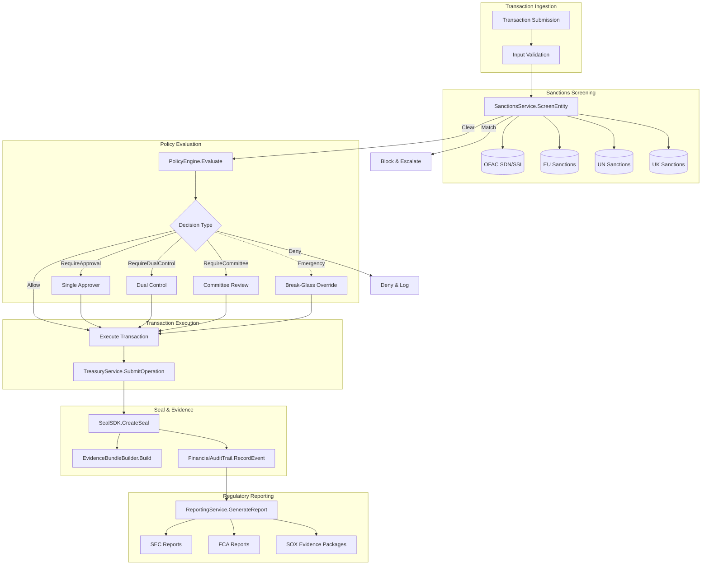

# Aethelred for Financial Services

## Reference Architecture: Payments, Treasury, and Financial Audit

**Version:** 1.0  
**Last Updated:** April 2026  
**Classification:** Public -- Procurement-Ready

---

## 1. Overview

### Problem Statement

Financial institutions operating AI-assisted transaction processing, risk scoring, and advisory services face a convergence of regulatory obligations: SOX requires auditable controls over financial reporting; PCI-DSS mandates cardholder data protection; SEC demands transparent algorithmic decision-making; and NIST AI RMF calls for documented risk governance across the AI lifecycle. No single platform addresses these requirements with cryptographic proof, dual-control enforcement, and immutable audit trails.

### Solution Approach

Aethelred provides an end-to-end integrity fabric for financial services. Every transaction passes through sanctions screening, policy evaluation with configurable dual-control approval workflows, and cryptographic seal creation. The result is a tamper-evident, regulator-ready audit trail that binds transaction data to compliance evidence at the protocol level.

### Key Differentiators

- **Cryptographic transaction integrity**: Every financial operation is sealed with a Digital Seal anchored to the Aethelred blockchain, producing immutable proof of execution
- **Dual-control enforcement**: The Policy Engine (`pkg/governance/policy`) supports `RequireDualControl` and `RequireCommittee` decision types with configurable approval workflows
- **SOX-ready audit trails**: The finance adapter (`pkg/integrations/finance`) generates `FinancialEvent` records categorized by type (transaction, approval, exception, reconciliation) with full party attribution
- **Multi-list sanctions screening**: Real-time screening against OFAC SDN, OFAC SSI, EU, UN, and UK sanctions lists with configurable match thresholds
- **Regulatory report generation**: Built-in reporting for SEC, FCA, MAS, SAMA, FINMA, and BaFin in JSON, XML, PDF, and CSV formats

---

## 2. Architecture Diagram



---

## 3. Component Map

| Aethelred Package | Role in Architecture | Key Types |
|---|---|---|
| `pkg/integrations/finance` | Sanctions screening, treasury workflows, audit trails, reporting | `SanctionsService`, `TreasuryService`, `FinancialAuditTrail`, `ReportingService` |
| `pkg/governance/policy` | Policy evaluation, dual-control approvals, break-glass overrides | `PolicyEngine`, `Decision` (Allow/Deny/RequireDualControl/RequireCommittee), `BreakGlassOverride` |
| `pkg/seal/sdk` | Digital Seal creation and verification | `SealSDK`, `Config`, `RegulatoryConfig` |
| `pkg/audit` | Audit Studio, evidence bundles, hash-chain integrity | `AuditStudio`, `EvidenceBundleBuilder`, `ControlMapping` |
| `pkg/compliance` | Regulatory framework mappings | `FrameworkDefinition`, `ControlMapping`, `CoverageLevel` |
| `pkg/compliance/frameworks` | SOC2, PCI-DSS specific control libraries | SOC2 Type II controls, PCI-DSS v4.0 requirements |
| `pkg/protocol/agent` | Agent-initiated financial operations with receipts | `ActionReceipt`, `DelegationScope` |
| `pkg/enterprise/billing` | Metering and usage-based billing for financial API consumption | Enterprise billing hooks |

---

## 4. Data Flow

### 4.1 Transaction Lifecycle

```
1. SUBMIT          Client submits transaction via API
                   ├── Transaction ID assigned
                   ├── Input validation (schema, limits, jurisdiction)
                   └── FinancialEvent(type=EventTransaction) recorded

2. SCREEN          SanctionsService.ScreenEntity() invoked
                   ├── Entity matched against DefaultLists (OFAC_SDN, OFAC_SSI, EU, UN, UK)
                   ├── MatchThreshold applied (configurable, 0-100)
                   ├── ScreeningResult with match details produced
                   └── FinancialEvent(type=EventScreening) recorded

3. EVALUATE        PolicyEngine.Evaluate() processes the request
                   ├── Rules evaluated in priority order
                   ├── Decision returned: Allow | Deny | RequireApproval | RequireDualControl
                   ├── If RequireDualControl: two independent approvers must sign off
                   └── FinancialEvent(type=EventApproval) recorded for each approval

4. EXECUTE         TreasuryService.SubmitOperation() executes the operation
                   ├── OperationStatus transitions: pending -> awaiting_approval -> approved -> executing -> completed
                   ├── OperationType: transfer | payment | fx_trade | settlement | reconciliation
                   └── FinancialEvent(type=EventTransaction) recorded with completion details

5. SEAL            SealSDK.CreateSeal() creates a Digital Seal
                   ├── ContentHash: SHA-256 of transaction data
                   ├── RegulatoryConfig: compliance frameworks, jurisdiction, retention
                   ├── Seal anchored to Aethelred blockchain
                   └── SealID returned for cross-reference

6. EVIDENCE        EvidenceBundleBuilder packages compliance evidence
                   ├── Audit records from steps 1-5 included
                   ├── ControlMapping links to SOC2/PCI-DSS/SOX controls
                   ├── Bundle signed with SHA-256 content hash
                   └── Exportable as JSON, CSV, or OSCAL

7. REPORT          ReportingService.GenerateReport() for regulatory filing
                   ├── ReportConfig specifies Regulator (SEC, FCA, MAS, etc.)
                   ├── ReportFormat: JSON | XML | PDF | CSV
                   ├── Time range, entity filters applied
                   └── Report sealed and evidence-linked
```

### 4.2 Exception Flow

When a transaction fails validation or is denied by policy:

```
1. Exception detected (screening match, policy denial, limit breach)
2. ExceptionService.RecordException() captures full context
3. Exception routed to designated handler based on ExceptionSeverity
4. If break-glass required: BreakGlassOverride with JustificationRequired=true
5. All exception handling recorded in FinancialAuditTrail
6. Evidence bundle generated for exception with full chain of custody
```

---

## 5. Control Matrix

| Control Requirement | Framework | Aethelred Capability | Evidence Generated | Coverage |
|---|---|---|---|---|
| Separation of duties | SOX, SOC2 CC6.1 | `RequireDualControl` decision type in PolicyEngine | Approval events with distinct approver identities | Full |
| Access control logging | SOC2 CC6.1, PCI-DSS 7.2 | `FinancialAuditTrail` with `EventAuditAccess` events | Timestamped access records with party attribution | Full |
| Change management | SOC2 CC8.1, SOX | `EventPolicyChange` events, Policy versioning | Policy change events with before/after state | Full |
| Transaction integrity | PCI-DSS 3.5, SOX | Digital Seals via `SealSDK.CreateSeal` | Seal ID, content hash, blockchain anchor | Full |
| Sanctions screening | OFAC, EU 4th AML Directive | `SanctionsService` with multi-list screening | Screening results, match scores, clear/block decisions | Full |
| Audit trail completeness | SOX 302/404, SOC2 CC7.2 | `FinancialAuditTrail` with 8 event types | Immutable event chain with hash integrity | Full |
| Encryption at rest | PCI-DSS 3.4 | Sovereign KMS integration | KMS key metadata, encryption attestation | Full |
| Incident response | SOC2 CC7.3 | Exception handling with escalation paths | Exception records, resolution timelines | Full |
| Regulatory reporting | SEC, FCA, MAS | `ReportingService` with multi-regulator support | Generated reports with seal attestation | Full |
| Data retention | SOC2 CC6.5, PCI-DSS 3.1 | `RegulatoryConfig.RetentionPeriodDays` on seals | Retention policy attached to every seal | Full |
| Break-glass governance | SOX, SOC2 CC6.1 | `BreakGlassOverride` with mandatory justification | Override event with approver, justification, duration | Full |
| Risk classification | NIST AI RMF MAP | `pkg/compliance` framework mappings | Risk assessment linked to control coverage | Full |

---

## 6. Evidence Model

Every financial operation produces the following evidence artifacts:

### 6.1 Per-Transaction Evidence

| Evidence Artifact | Source | Control Mapping |
|---|---|---|
| Transaction Seal | `SealSDK.CreateSeal` | SOX integrity, PCI-DSS 3.5 |
| Screening Result | `SanctionsService.ScreenEntity` | AML/CFT compliance |
| Policy Decision Record | `PolicyEngine.Evaluate` | SOX separation of duties |
| Approval Chain | Approval workflow records | SOX 302/404 |
| Financial Event | `FinancialAuditTrail.RecordEvent` | SOC2 CC7.2 |
| Evidence Bundle | `EvidenceBundleBuilder.Build` | Cross-framework evidence package |

### 6.2 Periodic Evidence

| Evidence Artifact | Frequency | Control Mapping |
|---|---|---|
| Regulatory Reports | Per regulator schedule | SEC, FCA, MAS obligations |
| SOX Evidence Package | Quarterly | SOX 404 internal controls |
| Hash Chain Integrity Report | Daily | Audit log tamper detection |
| Policy Coverage Assessment | On policy change | Compliance gap analysis |
| OSCAL Export | On demand | Federal agency submissions |

### 6.3 Evidence Bundle Structure

```json
{
  "bundle_id": "eb-fin-2026-04-09-001",
  "framework": "SOC2",
  "created_at": "2026-04-09T14:30:00Z",
  "content_hash": "sha256:a3b4c5d6...",
  "records": [...],
  "control_mappings": [
    {
      "control_id": "CC6.1",
      "description": "Logical and Physical Access Controls",
      "evidence_refs": ["seal-id-001", "event-id-042"],
      "coverage": "Full"
    }
  ],
  "attestations": [...]
}
```

---

## 7. Deployment Guide

### 7.1 Prerequisites

- Aethelred node (v1.0+) with `x/seal` module enabled
- Go 1.21+ runtime
- Network connectivity to sanctions list providers (or local cache for air-gapped deployments)
- HSM or software KMS for seal signing keys

### 7.2 Configuration

```go
import (
    "github.com/aethelred/aethelred/pkg/seal/sdk"
    "github.com/aethelred/aethelred/pkg/integrations/finance"
    "github.com/aethelred/aethelred/pkg/governance/policy"
    "github.com/aethelred/aethelred/pkg/audit"
)

// Initialize the Seal SDK
sealConfig := sdk.Config{
    NetworkEndpoint: "grpc://aethelred-node:9090",
    ChainID:         "aethelred-1",
    SignerAddress:    "aethelred1abc...",
    DefaultRegulatoryInfo: &sdk.RegulatoryConfig{
        DataClassification:   "financial-pii",
        ComplianceFrameworks: []string{"SOC2", "PCI-DSS", "SOX"},
        RetentionPeriodDays:  2555, // 7 years for SOX
        AuditRequired:        true,
    },
    Timeout:    30 * time.Second,
    MaxRetries: 3,
}

// Configure sanctions screening
sanctionsConfig := finance.SanctionsConfig{
    ScreeningProvider: "internal",
    DefaultLists:      []finance.SanctionsList{
        finance.SanctionsOFAC_SDN,
        finance.SanctionsOFAC_SSI,
        finance.SanctionsEU,
        finance.SanctionsUN,
        finance.SanctionsUK,
    },
    CacheTimeout:   15 * time.Minute,
    BlockOnMatch:   true,
    MatchThreshold: 85,
}

// Configure policy engine with dual-control for high-value transactions
policyEngine := policy.NewPolicyEngine(policy.EngineConfig{
    DefaultDecision: policy.Deny,
    AuditAll:        true,
})
```

### 7.3 Deployment Topology

```
┌─────────────────────────────────────────────┐
│              Load Balancer (TLS)             │
└──────────┬──────────────┬───────────────────┘
           │              │
   ┌───────▼──────┐ ┌────▼─────────┐
   │  API Gateway │ │  API Gateway │  (2+ instances)
   └───────┬──────┘ └────┬─────────┘
           │              │
   ┌───────▼──────────────▼──────────┐
   │     Aethelred Application       │
   │  ┌──────────────────────────┐   │
   │  │   Sanctions Screening    │   │
   │  │   Policy Engine          │   │
   │  │   Treasury Service       │   │
   │  │   Financial Audit Trail  │   │
   │  │   Reporting Service      │   │
   │  └──────────────────────────┘   │
   └───────┬──────────────┬──────────┘
           │              │
   ┌───────▼──────┐ ┌────▼─────────┐
   │  Aethelred   │ │    HSM /     │
   │  Validator   │ │  Software    │
   │  Node        │ │  KMS         │
   └──────────────┘ └──────────────┘
```

### 7.4 High Availability

- Deploy minimum 3 Aethelred validator nodes for consensus
- Application tier runs 2+ instances behind load balancer
- Sanctions list cache replicated across instances
- Policy Engine state backed by persistent storage
- Financial Audit Trail backed by append-only store with hash chain integrity

### 7.5 Disaster Recovery

- Evidence bundles exportable via `audit.Export` in JSON, CSV, and OSCAL formats
- Seal data recoverable from blockchain via `SealSDK.QuerySeal`
- Audit trail hash chain enables integrity verification after restore
- RTO: < 4 hours for full service restoration
- RPO: Zero data loss for sealed transactions (blockchain-anchored)

---

## 8. Compliance Mapping

### 8.1 SOC 2 Type II

| SOC 2 Trust Service Criteria | Aethelred Implementation |
|---|---|
| CC6.1 -- Logical and Physical Access | Policy Engine role-based evaluation, dual-control workflows |
| CC6.2 -- System Operations | Treasury operation lifecycle tracking (pending through completed) |
| CC6.3 -- Change Management | Policy versioning, `EventPolicyChange` audit events |
| CC6.5 -- Data Retention | `RegulatoryConfig.RetentionPeriodDays` enforced per seal |
| CC7.2 -- System Monitoring | Audit Studio continuous monitoring, 8 financial event types |
| CC7.3 -- Incident Response | Exception handling with severity-based escalation |
| CC8.1 -- Change Management | Policy Engine rule versioning with full change audit |

### 8.2 PCI-DSS v4.0

| PCI-DSS Requirement | Aethelred Implementation |
|---|---|
| 3.4 -- Render PAN Unreadable | Seal SDK encrypts cardholder data references, not raw PANs |
| 3.5 -- Protect Stored Account Data | KMS-managed encryption keys, HSM support |
| 7.2 -- Access Control Systems | Policy Engine with role-based and attribute-based rules |
| 10.2 -- Audit Trails | FinancialAuditTrail captures all access and transaction events |
| 10.3 -- Audit Trail Entries | Events include timestamp, party, action, resource, result |
| 10.7 -- Audit Trail Retention | Configurable retention via RegulatoryConfig (minimum 1 year) |

### 8.3 SOX Compliance

| SOX Section | Aethelred Implementation |
|---|---|
| Section 302 -- Corporate Responsibility | RequireDualControl decision type for material transactions |
| Section 404 -- Internal Controls | Full audit trail with evidence bundles for each control assertion |
| Section 802 -- Criminal Penalties for Altering Documents | Immutable blockchain-anchored seals prevent alteration |
| Section 906 -- CEO/CFO Certification | Evidence bundles provide attestation packages for certification |

### 8.4 NIST AI RMF

| NIST AI RMF Function | Aethelred Implementation |
|---|---|
| GOVERN -- Governance | Policy Engine with sector-specific financial templates |
| MAP -- Risk Framing | Compliance framework mappings identify applicable controls |
| MEASURE -- Risk Assessment | Continuous monitoring via Audit Studio, coverage assessments |
| MANAGE -- Risk Treatment | Exception handling, break-glass overrides, evidence generation |

---

## 9. Integration Patterns

### 9.1 Core Banking Integration

```
Core Banking System
    ├── REST API → Aethelred API Gateway
    │   ├── POST /v1/transactions/screen    → SanctionsService
    │   ├── POST /v1/transactions/evaluate  → PolicyEngine
    │   ├── POST /v1/transactions/execute   → TreasuryService
    │   └── GET  /v1/evidence/bundle/{id}   → EvidenceBundleBuilder
    │
    └── Event Stream → Aethelred Event Bus
        ├── transaction.submitted  → Screen + Evaluate
        ├── transaction.approved   → Execute + Seal
        └── transaction.completed  → Evidence + Report
```

### 9.2 Payment Processor Integration

```
Payment Gateway
    ├── Pre-authorization → Sanctions Screen + Policy Evaluate
    ├── Authorization     → Execute + Seal
    ├── Settlement        → Treasury reconciliation + Evidence bundle
    └── Chargeback        → Exception workflow + SOX evidence
```

### 9.3 Regulatory Filing

```
Scheduled Jobs
    ├── Daily   → Transaction reports (SEC/FCA)
    ├── Weekly  → AML summary reports
    ├── Monthly → Compliance coverage assessments
    └── Quarterly → SOX evidence packages
```

---

## 10. Operational Considerations

### 10.1 Performance

- Sanctions screening: < 100ms per entity (cached), < 500ms (uncached)
- Policy evaluation: < 50ms per request
- Seal creation: < 2s including blockchain confirmation
- Evidence bundle generation: < 5s for standard bundles

### 10.2 Monitoring

- Audit Studio provides real-time dashboards for transaction volume, screening hit rate, policy decision distribution
- Hash chain integrity verification runs continuously
- Alert on: screening match rate spikes, policy denial rate anomalies, seal creation failures

### 10.3 Capacity Planning

- Each sealed transaction produces approximately 2-5 KB of evidence data
- 7-year SOX retention at 10,000 transactions/day: approximately 50 TB total evidence storage
- Blockchain storage for seal anchors: approximately 200 bytes per seal
