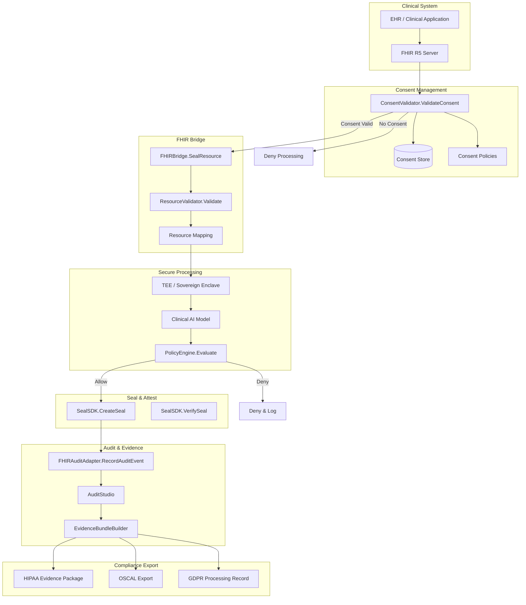

# Aethelred for Healthcare AI

## Reference Architecture: Clinical Decision Support, FHIR Integration, and PHI Protection

**Version:** 1.0  
**Last Updated:** April 2026  
**Classification:** Public -- Procurement-Ready

---

## 1. Overview

### Problem Statement

Healthcare organizations deploying AI for clinical decision support, diagnostic assistance, and care coordination face overlapping regulatory demands: HIPAA mandates protected health information (PHI) safeguards with audit controls; GDPR requires lawful processing with data subject rights; the EU AI Act classifies clinical AI as high-risk with conformity assessment obligations; and NIST AI RMF calls for structured risk management. These requirements intersect around a central need: demonstrable, auditable control over AI operations that touch patient data.

### Solution Approach

Aethelred provides a healthcare-grade integrity layer that bridges clinical systems via FHIR R5, enforces consent before any PHI processing, seals clinical data with tamper-evident Digital Seals, and generates HIPAA-compliant audit trails. The FHIR adapter (`pkg/integrations/fhir`) provides bidirectional conversion between FHIR R5 resources and Aethelred seals, while the Audit Studio ensures every operation on patient data is immutably recorded.

### Key Differentiators

- **Native FHIR R5 integration**: `FHIRBridge` provides bidirectional conversion between FHIR resources (Patient, Observation, DiagnosticReport, Consent) and Aethelred Digital Seals
- **Consent-gated processing**: `ConsentRequired` flag in `BridgeConfig` enforces consent validation before any patient resource is sealed or processed
- **PHI-aware seal classification**: `RegulatoryConfig` attaches data classification, jurisdiction restrictions, and retention policies directly to seals
- **Sovereign deployment for PHI**: Dedicated sovereign deployment mode ensures PHI never leaves approved infrastructure boundaries
- **HIPAA audit events**: FHIR audit adapter generates AuditEvent resources per FHIR R5 specification alongside Aethelred audit records

---

## 2. Architecture Diagram



---

## 3. Component Map

| Aethelred Package | Role in Architecture | Key Types |
|---|---|---|
| `pkg/integrations/fhir` | FHIR R5 resource bridge, consent validation, audit events | `FHIRBridge`, `BridgeConfig`, `ConsentValidator`, `FHIRAuditAdapter`, `ResourceValidator` |
| `pkg/seal/sdk` | Digital Seal creation and verification for clinical data | `SealSDK`, `RegulatoryConfig` (data classification, jurisdiction, retention) |
| `pkg/governance/policy` | Clinical AI policy evaluation, approval workflows | `PolicyEngine`, `Decision`, sector-specific healthcare templates |
| `pkg/audit` | Audit Studio, evidence bundles, OSCAL export | `AuditStudio`, `EvidenceBundleBuilder`, `ControlMapping` |
| `pkg/compliance/frameworks` | HIPAA control library, NIST AI RMF mappings | HIPAA framework definition, EU AI Act high-risk controls |
| `pkg/deploy/sovereign` | Sovereign deployment for PHI isolation | Sovereign enclave configuration, data residency enforcement |
| `pkg/assurance` | Enterprise Assurance Fabric for continuous monitoring | Assurance policies, compliance drift detection |
| `pkg/evidence` | Evidence portability across jurisdictions | Cross-format evidence export, chain of custody |

---

## 4. Data Flow

### 4.1 Clinical Decision Support Lifecycle

```
1. INGEST          Clinical data arrives as FHIR R5 resources
                   ├── Resource types: Patient, Observation, DiagnosticReport, Condition
                   ├── ResourceValidator.Validate() checks FHIR conformance
                   └── Resource registered with FHIRBridge

2. CONSENT         ConsentValidator.ValidateConsent() invoked
                   ├── Consent resource retrieved from consent store
                   ├── Purpose of use validated against consent scope
                   ├── Temporal validity checked (consent period)
                   ├── If ConsentRequired=true and no valid consent: processing blocked
                   └── Consent decision recorded as audit event

3. BRIDGE          FHIRBridge.SealResource() converts to Aethelred seal
                   ├── FHIR resource serialized with canonical JSON
                   ├── SHA-256 content hash computed
                   ├── RegulatoryConfig applied:
                   │   ├── DataClassification: "phi"
                   │   ├── ComplianceFrameworks: ["HIPAA", "NIST-AI-RMF"]
                   │   ├── JurisdictionRestrictions: per patient location
                   │   └── RetentionPeriodDays: per HIPAA minimum (6 years)
                   └── Resource-to-seal mapping stored

4. PROCESS         Clinical AI processing in sovereign enclave
                   ├── Data processed within TEE boundary
                   ├── Model inference executed
                   ├── PolicyEngine.Evaluate() assesses output
                   └── Decision: Allow | Deny | RequireApproval (clinician review)

5. SEAL            SealSDK.CreateSeal() for AI output
                   ├── Input seal ID referenced (provenance chain)
                   ├── AI model version recorded
                   ├── Output sealed with content hash
                   └── Seal anchored to blockchain

6. AUDIT           FHIRAuditAdapter.RecordAuditEvent()
                   ├── FHIR AuditEvent resource generated
                   ├── Maps to Aethelred audit record
                   ├── Includes: agent, entity, outcome, timestamp
                   └── Hash chain maintained for integrity

7. EVIDENCE        EvidenceBundleBuilder generates compliance package
                   ├── HIPAA: access logs, consent records, PHI handling proof
                   ├── GDPR: processing records, lawful basis, data subject rights
                   ├── NIST AI RMF: risk assessment, governance evidence
                   └── Exportable as JSON, OSCAL, or regulatory-specific format
```

### 4.2 Consent Revocation Flow

```
1. Patient revokes consent via provider portal
2. ConsentValidator detects revoked consent
3. All subsequent processing requests for affected resources are blocked
4. Existing seals marked with consent revocation metadata
5. FHIRAuditAdapter records revocation event
6. Evidence bundle updated with revocation record
7. GDPR erasure request workflow triggered if applicable
```

---

## 5. Control Matrix

| Control Requirement | Framework | Aethelred Capability | Evidence Generated | Coverage |
|---|---|---|---|---|
| Access controls for PHI | HIPAA 164.312(a) | PolicyEngine role-based evaluation | Policy decision records with user identity | Full |
| Audit controls | HIPAA 164.312(b) | FHIRAuditAdapter + AuditStudio | FHIR AuditEvent resources, hash-chained audit log | Full |
| Integrity controls | HIPAA 164.312(c) | Digital Seals on all PHI resources | Seal ID, content hash, blockchain anchor | Full |
| Transmission security | HIPAA 164.312(e) | TLS enforcement, sovereign deployment | Transport attestation in seal metadata | Full |
| Consent management | HIPAA 164.508, GDPR Art. 7 | ConsentValidator with mandatory consent check | Consent validation records per operation | Full |
| Minimum necessary | HIPAA 164.502(b) | FHIR resource-level access control | Resource access logs with purpose of use | Full |
| Right of access | GDPR Art. 15 | FHIR resource query with provenance | Evidence bundle with complete processing history | Full |
| Right to erasure | GDPR Art. 17 | Sovereign deployment with data lifecycle | Erasure confirmation with sealed proof | Partial |
| High-risk AI conformity | EU AI Act Art. 43 | Compliance framework mappings + evidence bundles | Conformity assessment evidence package | Full |
| Human oversight | EU AI Act Art. 14 | RequireApproval for clinical decisions | Clinician approval records with rationale | Full |
| Technical documentation | EU AI Act Art. 11 | Evidence portability + seal provenance | Complete technical documentation bundle | Full |
| Risk management | NIST AI RMF GOVERN/MAP/MEASURE/MANAGE | Full lifecycle governance coverage | Framework-specific evidence at each stage | Full |

---

## 6. Evidence Model

### 6.1 Per-Clinical-Operation Evidence

| Evidence Artifact | Source | Control Mapping |
|---|---|---|
| Consent Validation Record | `ConsentValidator.ValidateConsent` | HIPAA 164.508, GDPR Art. 7 |
| FHIR AuditEvent | `FHIRAuditAdapter.RecordAuditEvent` | HIPAA 164.312(b) |
| Clinical Data Seal | `SealSDK.CreateSeal` | HIPAA 164.312(c) |
| AI Output Seal | `SealSDK.CreateSeal` (with input provenance) | EU AI Act Art. 11 |
| Policy Decision | `PolicyEngine.Evaluate` | HIPAA 164.312(a) |
| Evidence Bundle | `EvidenceBundleBuilder.Build` | Cross-framework compliance package |

### 6.2 HIPAA Evidence Package Structure

```json
{
  "bundle_id": "eb-hipaa-2026-04-09-001",
  "framework": "HIPAA",
  "content_hash": "sha256:e4f5a6b7...",
  "consent_records": [
    {
      "patient_id": "Patient/123",
      "consent_id": "Consent/456",
      "purpose": "clinical-decision-support",
      "valid_from": "2026-01-01T00:00:00Z",
      "valid_to": "2027-01-01T00:00:00Z",
      "status": "active"
    }
  ],
  "audit_events": [...],
  "seal_references": [...],
  "control_mappings": [
    {
      "control_id": "164.312(b)",
      "description": "Audit Controls",
      "evidence_refs": ["audit-event-001", "audit-event-002"],
      "coverage": "Full"
    }
  ]
}
```

---

## 7. Deployment Guide

### 7.1 Prerequisites

- Aethelred node (v1.0+) with `x/seal` module enabled
- FHIR R5 compliant server (HAPI FHIR, Microsoft FHIR Server, or equivalent)
- Go 1.21+ runtime
- HSM for PHI seal signing keys (FIPS 140-2 Level 3 recommended)
- Sovereign deployment infrastructure for PHI isolation

### 7.2 Configuration

```go
import (
    "github.com/aethelred/aethelred/pkg/integrations/fhir"
    "github.com/aethelred/aethelred/pkg/seal/sdk"
    "github.com/aethelred/aethelred/pkg/governance/policy"
)

// FHIR Bridge configuration
bridgeConfig := fhir.BridgeConfig{
    Endpoint:            "https://fhir-server.internal:8443/fhir",
    AuthToken:           os.Getenv("FHIR_AUTH_TOKEN"),
    DefaultJurisdiction: "US",
    ConsentRequired:     true,
    DefaultRetentionDays: 2190, // 6 years HIPAA minimum
}

// Seal SDK with healthcare regulatory defaults
sealConfig := sdk.Config{
    NetworkEndpoint: "grpc://aethelred-node:9090",
    ChainID:         "aethelred-1",
    SignerAddress:    "aethelred1abc...",
    DefaultRegulatoryInfo: &sdk.RegulatoryConfig{
        DataClassification:       "phi",
        ComplianceFrameworks:     []string{"HIPAA", "NIST-AI-RMF", "EU-AI-Act"},
        JurisdictionRestrictions: []string{"US", "EU"},
        RetentionPeriodDays:      2190,
        AuditRequired:            true,
    },
}

// Policy engine with healthcare templates
policyEngine := policy.NewPolicyEngine(policy.EngineConfig{
    DefaultDecision: policy.Deny,
    AuditAll:        true,
})
// Load healthcare-specific policy rules
policyEngine.LoadSectorTemplate("healthcare")
```

### 7.3 Deployment Topology

```
┌──────────────────────────────────────────────────┐
│            Sovereign Boundary (PHI Zone)          │
│                                                   │
│  ┌────────────┐    ┌──────────────────────────┐  │
│  │ FHIR R5    │    │  Aethelred Application   │  │
│  │ Server     │◄──►│  ┌────────────────────┐  │  │
│  └────────────┘    │  │ FHIR Bridge        │  │  │
│                    │  │ Consent Validator   │  │  │
│  ┌────────────┐    │  │ Policy Engine       │  │  │
│  │ Clinical   │    │  │ Audit Adapter       │  │  │
│  │ AI Models  │◄──►│  │ Evidence Builder    │  │  │
│  │ (TEE)      │    │  └────────────────────┘  │  │
│  └────────────┘    └─────────┬────────────────┘  │
│                              │                    │
│  ┌────────────┐    ┌────────▼─────────┐          │
│  │ HSM (FIPS  │    │ Aethelred        │          │
│  │ 140-2 L3)  │◄──►│ Validator Node   │          │
│  └────────────┘    └──────────────────┘          │
│                                                   │
└──────────────────────────────────────────────────┘
```

### 7.4 PHI Data Residency

- All PHI processing occurs within the sovereign boundary
- FHIR resources never leave the approved infrastructure zone
- Seal metadata (non-PHI) can be replicated to external nodes
- Evidence bundles can be exported with PHI redacted for external audit
- Data residency enforced by `pkg/deploy/sovereign` configuration

---

## 8. Compliance Mapping

### 8.1 HIPAA Security Rule

| HIPAA Standard | Section | Aethelred Implementation |
|---|---|---|
| Access Control | 164.312(a) | PolicyEngine with role-based rules, minimum necessary enforcement |
| Audit Controls | 164.312(b) | FHIRAuditAdapter generates AuditEvent resources, AuditStudio maintains hash chain |
| Integrity | 164.312(c) | Digital Seals with SHA-256 content hash, blockchain anchoring |
| Authentication | 164.312(d) | Agent Trust Protocol with DID-based identity |
| Transmission Security | 164.312(e) | TLS enforcement, sovereign deployment boundaries |
| Facility Access | 164.310(a) | Sovereign deployment with infrastructure-level controls |
| Workstation Security | 164.310(b) | Policy Engine workstation-level rules |
| Device and Media | 164.310(d) | Seal-based media tracking, evidence of disposition |

### 8.2 GDPR

| GDPR Article | Aethelred Implementation |
|---|---|
| Art. 6 -- Lawful Processing | Consent validation via ConsentValidator with purpose-of-use tracking |
| Art. 7 -- Conditions for Consent | Consent resource management with temporal validity |
| Art. 13/14 -- Information Provision | Evidence bundles document processing activities |
| Art. 15 -- Right of Access | FHIR resource query with complete provenance chain |
| Art. 17 -- Right to Erasure | Sovereign deployment with data lifecycle management |
| Art. 25 -- Data Protection by Design | Consent-gated processing, minimum necessary access |
| Art. 30 -- Records of Processing | Audit trail with complete processing history |
| Art. 35 -- DPIA | Compliance framework mappings provide impact assessment evidence |

### 8.3 EU AI Act (High-Risk)

| EU AI Act Requirement | Aethelred Implementation |
|---|---|
| Art. 9 -- Risk Management | NIST AI RMF alignment via compliance framework mappings |
| Art. 10 -- Data Governance | FHIR bridge validates data quality, consent enforced |
| Art. 11 -- Technical Documentation | Evidence bundles provide complete documentation package |
| Art. 13 -- Transparency | Seal provenance chain documents AI decision lineage |
| Art. 14 -- Human Oversight | RequireApproval for clinical decisions, clinician review workflow |
| Art. 15 -- Accuracy and Robustness | Continuous monitoring via Assurance Fabric |
| Art. 43 -- Conformity Assessment | Evidence packages structured for conformity body review |

---

## 9. FHIR Resource Mapping

### 9.1 Supported FHIR R5 Resources

| FHIR Resource | Aethelred Operation | Seal Binding |
|---|---|---|
| Patient | Identity registration, consent anchor | Patient seal with demographic hash |
| Observation | Clinical data capture | Observation seal with value hash |
| DiagnosticReport | AI-generated report | Report seal with input provenance |
| Consent | Processing authorization | Consent seal with scope and period |
| AuditEvent | Audit record | Generated by FHIRAuditAdapter |
| Provenance | Processing lineage | Maps to seal provenance chain |
| DocumentReference | Evidence bundle reference | Bundle seal with content hash |

### 9.2 FHIR AuditEvent Mapping

```
FHIR AuditEvent                    Aethelred Audit Record
├── type.code                  →   Category
├── subtype[].code             →   Sub-category
├── recorded                   →   Timestamp
├── outcome.code               →   Result
├── agent[].who                →   Actor identity
├── entity[].what              →   Resource reference
├── entity[].role              →   Role (source/target/query)
└── source.observer            →   System identifier
```

---

## 10. Operational Considerations

### 10.1 Performance

- Consent validation: < 20ms per request (cached consent store)
- FHIR resource sealing: < 500ms including bridge conversion
- Clinical AI policy evaluation: < 50ms
- Evidence bundle generation: < 3s for standard bundles

### 10.2 Consent Cache Management

- Consent decisions cached with TTL matching consent validity period
- Cache invalidated immediately on consent revocation
- Background sync ensures cache consistency with FHIR consent store

### 10.3 PHI Audit Retention

- HIPAA minimum: 6 years from creation or last effective date
- Configurable per organization via `DefaultRetentionDays`
- Audit records immutable once sealed; retention enforced at storage layer
