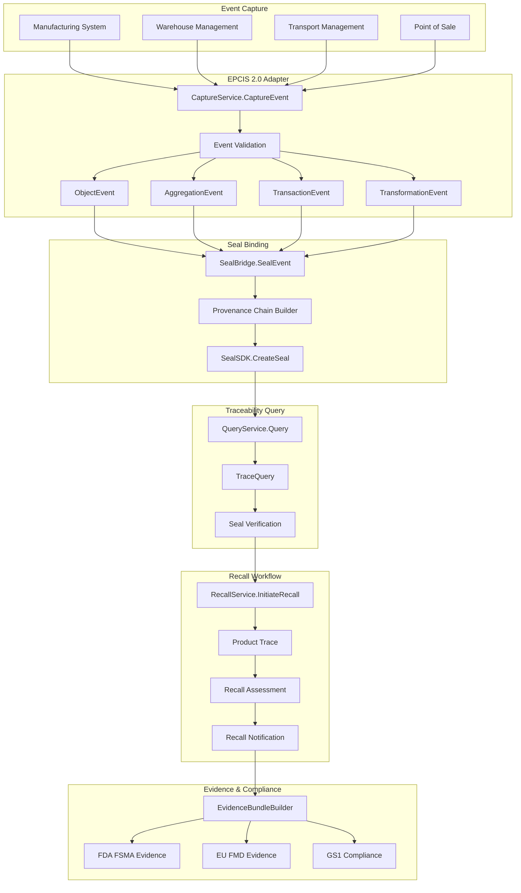

# Aethelred for Supply Chain Traceability

## Reference Architecture: Product Traceability, EPCIS Integration, and Recall Workflows

**Version:** 1.0  
**Last Updated:** April 2026  
**Classification:** Public -- Procurement-Ready

---

## 1. Overview

### Problem Statement

Supply chain operators face increasing regulatory pressure to demonstrate end-to-end traceability: FDA FSMA requires one-step-up, one-step-down tracking for food products; EU FMD mandates serialization and verification for pharmaceuticals; and GS1 EPCIS 2.0 defines the interoperability standard for supply chain events. Existing solutions provide event capture but lack cryptographic proof of provenance, tamper-evident audit trails, and automated recall workflows with regulator-ready evidence.

### Solution Approach

Aethelred integrates natively with EPCIS 2.0 event streams via the supply chain adapter (`pkg/integrations/epcis`), binding each capture event to a Digital Seal that creates an immutable provenance chain. Recall workflows leverage this chain to identify all affected products with cryptographic certainty, producing evidence packages that satisfy both regulators and trading partners.

### Key Differentiators

- **Native EPCIS 2.0 support**: Full event type coverage (ObjectEvent, AggregationEvent, TransactionEvent, TransformationEvent) with CBV 2.0 business step vocabulary
- **Seal-bound provenance**: Each EPCIS event is sealed via `SealBridge`, creating a cryptographically linked provenance chain across the supply chain
- **Automated recall workflows**: `RecallService` traces affected products through provenance chains and generates recall evidence packages
- **Traceability queries**: `QueryService` supports EPCIS 2.0 SimpleEventQuery with seal verification at each step
- **Evidence portability**: Provenance evidence exportable for FDA, EU FMD, and trading partner verification

---

## 2. Architecture Diagram



---

## 3. Component Map

| Aethelred Package | Role in Architecture | Key Types |
|---|---|---|
| `pkg/integrations/epcis` | EPCIS 2.0 event capture, query, seal binding, recall | `CaptureService`, `QueryService`, `SealBridge`, `RecallService` |
| `pkg/seal/sdk` | Digital Seal creation and verification | `SealSDK`, `RegulatoryConfig` |
| `pkg/audit` | Audit Studio, evidence bundles | `AuditStudio`, `EvidenceBundleBuilder` |
| `pkg/governance/policy` | Supply chain policy evaluation | `PolicyEngine` with supply chain rules |
| `pkg/compliance` | Regulatory framework mappings | GS1 EPCIS 2.0, FDA FSMA, EU FMD controls |
| `pkg/evidence` | Evidence portability across trading partners | Cross-format export, chain of custody |
| `pkg/protocol/agent` | Automated supply chain agent operations | `ActionReceipt` for agent-initiated events |

---

## 4. Data Flow

### 4.1 EPCIS Event Lifecycle

```
1. CAPTURE         Supply chain system generates EPCIS event
                   ├── EventType: ObjectEvent | AggregationEvent | TransactionEvent | TransformationEvent
                   ├── Action: ADD | OBSERVE | DELETE
                   ├── BizStep: commissioning | shipping | receiving | storing | packing | ...
                   ├── EPCList: item-level identifiers (SGTIN, SSCC, GRAI)
                   └── CaptureService.CaptureEvent() validates and stores

2. VALIDATE        Event validation against EPCIS 2.0 schema
                   ├── EPC format validation
                   ├── Business step vocabulary check (CBV 2.0)
                   ├── Disposition code validation
                   ├── Read point / business location verification
                   └── Master data reference validation

3. SEAL            SealBridge.SealEvent() creates seal binding
                   ├── Event serialized with canonical JSON
                   ├── SHA-256 content hash computed
                   ├── Previous seal referenced (provenance chain)
                   ├── RegulatoryConfig applied:
                   │   ├── ComplianceFrameworks: ["GS1-EPCIS", "FDA-FSMA"]
                   │   └── RetentionPeriodDays: per regulatory requirement
                   └── SealID returned and stored with event

4. CHAIN           Provenance chain construction
                   ├── Parent seal ID links to previous custody event
                   ├── Chain traversable forward (tracking) and backward (tracing)
                   ├── AggregationEvent seals reference child item seals
                   └── TransformationEvent seals reference input/output lineage

5. QUERY           QueryService.Query() for traceability
                   ├── SimpleEventQuery by EPC, time range, bizStep, disposition
                   ├── Each result includes seal verification status
                   ├── Provenance chain returned with each query
                   └── Trading partner verification via seal proof

6. RECALL          RecallService.InitiateRecall() when triggered
                   ├── Affected EPCs identified via provenance chain traversal
                   ├── All downstream custody events traced
                   ├── Recall scope assessed (product, lot, batch)
                   ├── Notifications generated for affected parties
                   └── Evidence package assembled for regulator

7. EVIDENCE        EvidenceBundleBuilder packages compliance proof
                   ├── FDA FSMA: one-step-up, one-step-down traceability
                   ├── EU FMD: serialization and verification records
                   ├── GS1: EPCIS 2.0 conformance evidence
                   └── Exportable for regulator or trading partner
```

### 4.2 Recall Workflow Detail

```
1. Recall trigger received (safety signal, quality issue, regulatory mandate)
2. RecallService.InitiateRecall() with affected product identifiers
3. Provenance chain traversal identifies all custody events
4. Downstream distribution traced to final recipients
5. RecallAssessment generated with scope, severity, affected quantities
6. RecallNotification produced per affected trading partner
7. Evidence bundle includes:
   ├── Complete provenance chain with seal verification
   ├── Affected product list with location history
   ├── Notification records with delivery confirmation
   └── Regulatory submission package (FDA, EU FMD)
8. Recall status monitored: initiated -> in_progress -> completed
```

---

## 5. Control Matrix

| Control Requirement | Framework | Aethelred Capability | Evidence Generated | Coverage |
|---|---|---|---|---|
| Product serialization | GS1, EU FMD | EPCIS event capture with EPC identifiers | Event records with SGTIN/SSCC | Full |
| Event integrity | GS1 EPCIS 2.0 | SealBridge binds each event to Digital Seal | Seal ID, content hash per event | Full |
| One-step traceability | FDA FSMA 204 | QueryService with provenance chain | Upstream/downstream custody chain | Full |
| Provenance chain | GS1, FDA | SealBridge provenance chain construction | Linked seal chain across custody events | Full |
| Recall management | FDA, EU FMD | RecallService with automated trace | Recall evidence package with affected product list | Full |
| Audit trail | GS1, FDA FSMA | AuditStudio with event logging | Hash-chained audit records | Full |
| Data retention | FDA (2 years), EU FMD (1 year+) | RegulatoryConfig.RetentionPeriodDays | Retention policy per seal | Full |
| Trading partner verification | GS1 | Seal verification via SealSDK.VerifySeal | Verification proof for each query | Full |
| Business step vocabulary | GS1 CBV 2.0 | EPCIS adapter CBV constants | Event validation records | Full |
| Transformation lineage | GS1 EPCIS 2.0 | TransformationEvent with input/output seals | Input-to-output provenance | Full |

---

## 6. Evidence Model

### 6.1 Per-Event Evidence

| Evidence Artifact | Source | Control Mapping |
|---|---|---|
| EPCIS Event Record | `CaptureService.CaptureEvent` | GS1 event capture |
| Event Seal | `SealBridge.SealEvent` | Event integrity |
| Provenance Link | Seal chain reference | Traceability chain |
| Validation Result | Event validation | EPCIS 2.0 conformance |

### 6.2 Per-Recall Evidence

| Evidence Artifact | Source | Control Mapping |
|---|---|---|
| Recall Assessment | `RecallService` | FDA recall management |
| Provenance Chain | Chain traversal | End-to-end traceability |
| Affected Product List | Chain analysis | Recall scope |
| Notification Records | Recall notifications | Trading partner notification |
| Regulatory Submission | Evidence bundle export | FDA/EU FMD filing |

### 6.3 EPCIS Event Seal Structure

```json
{
  "seal_id": "seal-epcis-2026-04-09-001",
  "content_hash": "sha256:b7c8d9e0...",
  "event_type": "ObjectEvent",
  "action": "ADD",
  "biz_step": "urn:epcglobal:cbv:bizstep:commissioning",
  "epc_list": ["urn:epc:id:sgtin:0614141.107346.2017"],
  "read_point": "urn:epc:id:sgln:0614141.00777.0",
  "biz_location": "urn:epc:id:sgln:0614141.00888.0",
  "parent_seal_id": "seal-epcis-2026-04-08-042",
  "regulatory_config": {
    "compliance_frameworks": ["GS1-EPCIS", "FDA-FSMA"],
    "retention_period_days": 730
  }
}
```

---

## 7. Deployment Guide

### 7.1 Prerequisites

- Aethelred node (v1.0+) with `x/seal` module enabled
- EPCIS 2.0 capable supply chain systems (SAP IBP, Oracle SCM, or equivalent)
- Go 1.21+ runtime
- GS1 registered company prefix for EPC generation

### 7.2 Configuration

```go
import (
    "github.com/aethelred/aethelred/pkg/integrations/epcis"
    "github.com/aethelred/aethelred/pkg/seal/sdk"
)

// Initialize EPCIS adapter
captureService := epcis.NewCaptureService(epcis.CaptureConfig{
    ValidateEPCs:    true,
    ValidateBizStep: true,
    AutoSeal:        true, // automatically seal each captured event
})

// Seal SDK for supply chain
sealConfig := sdk.Config{
    NetworkEndpoint: "grpc://aethelred-node:9090",
    ChainID:         "aethelred-1",
    SignerAddress:    "aethelred1abc...",
    DefaultRegulatoryInfo: &sdk.RegulatoryConfig{
        ComplianceFrameworks: []string{"GS1-EPCIS", "FDA-FSMA"},
        RetentionPeriodDays:  730, // 2 years FDA minimum
        AuditRequired:        true,
    },
}

// Initialize recall service
recallService := epcis.NewRecallService(epcis.RecallConfig{
    AutoTrace:          true,
    NotifyPartners:     true,
    GenerateEvidence:   true,
})
```

### 7.3 Deployment Topology

```
┌────────────────────────────────────────────────┐
│         Supply Chain Partner Network            │
│                                                 │
│  ┌──────────┐  ┌──────────┐  ┌──────────┐     │
│  │ Supplier │  │ Mfg Site │  │ Distrib. │     │
│  │ System   │  │ MES/WMS  │  │ WMS/TMS  │     │
│  └────┬─────┘  └────┬─────┘  └────┬─────┘     │
│       │              │              │           │
│       └──────────────┼──────────────┘           │
│                      │                          │
│            ┌─────────▼──────────┐               │
│            │  Aethelred EPCIS   │               │
│            │  ┌──────────────┐  │               │
│            │  │ CaptureServ. │  │               │
│            │  │ QueryService │  │               │
│            │  │ SealBridge   │  │               │
│            │  │ RecallServ.  │  │               │
│            │  └──────────────┘  │               │
│            └─────────┬──────────┘               │
│                      │                          │
│            ┌─────────▼──────────┐               │
│            │  Aethelred Node    │               │
│            │  (Seal Anchoring)  │               │
│            └────────────────────┘               │
└────────────────────────────────────────────────┘
```

### 7.4 Multi-Partner Configuration

- Each trading partner can run their own Aethelred node or use a shared network
- Seal verification is cross-node: any node can verify seals from any other node
- Provenance chains span partner boundaries via seal references
- Trading partner data privacy maintained through seal-level access controls

---

## 8. Compliance Mapping

### 8.1 GS1 EPCIS 2.0

| EPCIS 2.0 Requirement | Aethelred Implementation |
|---|---|
| Event type support | All 4 types: ObjectEvent, AggregationEvent, TransactionEvent, TransformationEvent |
| CBV 2.0 vocabulary | Full business step constants (commissioning through destroying) |
| Event capture | CaptureService with validation |
| Event query | QueryService with SimpleEventQuery |
| Event integrity | SealBridge seals each event |
| Master data | Master data reference validation |

### 8.2 FDA FSMA Section 204

| FSMA 204 Requirement | Aethelred Implementation |
|---|---|
| Key data elements | Captured in EPCIS event fields (EPCs, dates, locations, parties) |
| Critical tracking events | Mapped to EPCIS event types with business steps |
| Traceability lot code | Tracked via SGTIN/SSCC identifiers in EPC lists |
| One-step-up, one-step-down | QueryService provenance chain traversal |
| Records within 24 hours | Automated evidence bundle generation |
| Sortable, searchable records | QueryService with multi-field filtering |

### 8.3 EU Falsified Medicines Directive

| EU FMD Requirement | Aethelred Implementation |
|---|---|
| Unique identifier (serialization) | SGTIN identifiers in EPCIS events |
| Anti-tampering device | Digital Seal integrity verification |
| End-to-end verification | Provenance chain with seal at each step |
| National repositories | Evidence bundle export for national systems |
| Decommissioning | EPCIS ObjectEvent with ActionDELETE |

---

## 9. Integration Patterns

### 9.1 SAP Integration

```
SAP IBP / SAP EWM
    ├── EPCIS Document via REST API → CaptureService
    ├── ASN/Shipment events → ObjectEvent (shipping)
    ├── GR/Receipt events → ObjectEvent (receiving)
    └── Query API for traceability → QueryService
```

### 9.2 IoT Sensor Integration

```
IoT Gateway
    ├── Temperature/humidity readings → EPCIS SensorElement
    ├── Location tracking → ReadPoint updates
    ├── Condition monitoring → Business step transitions
    └── Alert triggers → PolicyEngine evaluation → RecallService
```

---

## 10. Operational Considerations

### 10.1 Performance

- Event capture and sealing: < 1s per event
- Provenance chain query (10-hop): < 2s with seal verification
- Recall trace (10,000 items): < 30s
- Evidence bundle generation: < 10s

### 10.2 Scale

- Support for millions of EPCIS events per day
- Provenance chains spanning thousands of custody events
- Multi-partner networks with hundreds of participants
- Seal storage: approximately 500 bytes per event seal
