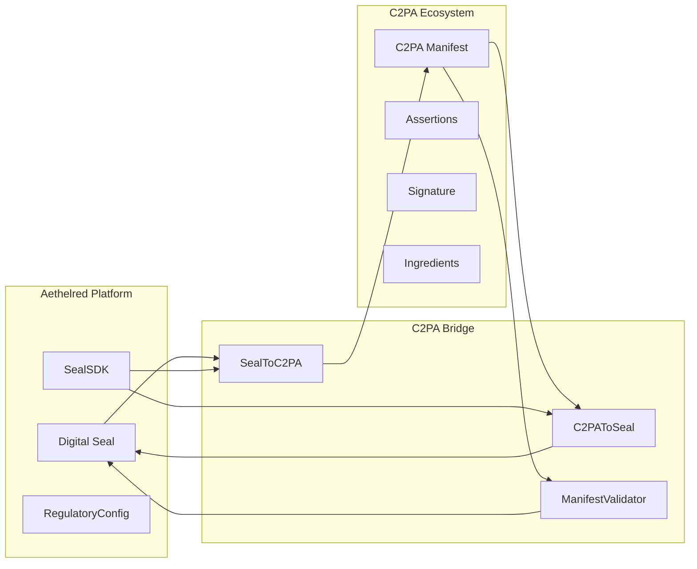
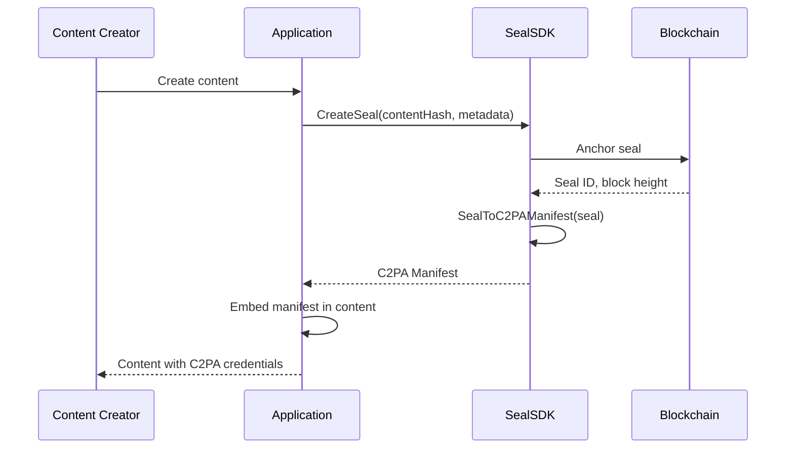
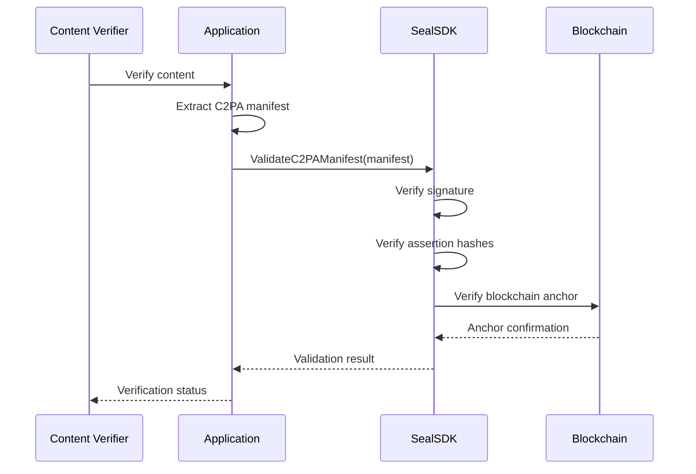
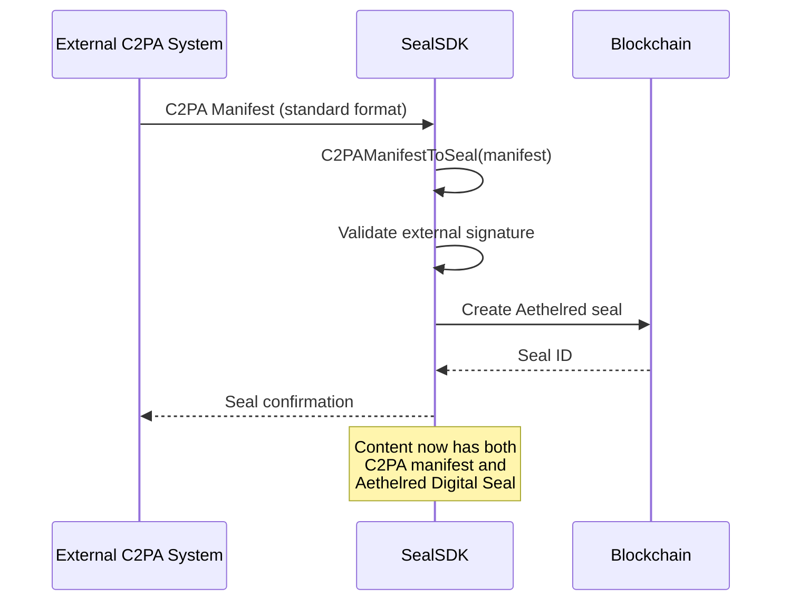

# Aethelred C2PA Content Credentials Bridge

## Digital Seals to C2PA Manifest Mapping and Implementation Guide

**Version:** 1.0  
**Last Updated:** April 2026  
**Classification:** Public -- Procurement-Ready

---

## 1. Overview

The Coalition for Content Provenance and Authenticity (C2PA) defines an open standard for certifying the provenance of digital content. Aethelred's C2PA bridge (`pkg/seal/sdk/c2pa.go`) provides bidirectional conversion between Aethelred Digital Seals and C2PA manifests, enabling interoperability with the broader content authenticity ecosystem.

This guide documents the mapping between Aethelred seal structures and C2PA manifest components, implementation patterns, and verification workflows.

---

## 2. Architecture



---

## 3. Seal-to-Manifest Mapping

### 3.1 Core Structure Mapping

| Aethelred Digital Seal | C2PA Manifest (`C2PAManifest`) | Notes |
|---|---|---|
| Seal ID | `InstanceID` | Unique identifier for the manifest instance |
| Content Hash (SHA-256) | `Assertions[].Hash` (label: `c2pa.hash.data`) | Content integrity assertion |
| Creator Address | `ClaimGenerator` | Software that created the manifest |
| Creation Time | `CreatedAt` | Manifest generation timestamp |
| Regulatory Config | Custom assertion (label: `aethelred.seal.regulatory`) | Extended assertion for regulatory metadata |
| Blockchain Anchor | Custom assertion (label: `aethelred.seal.blockchain`) | Chain ID, block height, transaction hash |
| Verification Status | Custom assertion (label: `aethelred.seal.verification`) | Verification result with proof |

### 3.2 C2PA Manifest Structure

The `C2PAManifest` type in `pkg/seal/sdk/c2pa.go`:

```
C2PAManifest
├── ClaimGenerator: string         -- Aethelred Seal SDK identifier
├── ClaimGeneratorVersion: string  -- SDK version
├── Title: string                  -- Content title
├── Format: string                 -- Content MIME type
├── InstanceID: string             -- Maps from Seal ID
├── Assertions: []C2PAAssertion    -- Provenance claims
│   ├── Label: string              -- Assertion type identifier
│   ├── Data: map[string]any       -- Assertion payload
│   └── Hash: string               -- SHA-256 of assertion data
├── Signature: C2PASignature       -- Cryptographic signature
│   ├── Algorithm: string          -- Signing algorithm (ECDSA)
│   ├── Certificate: string        -- Signing certificate
│   ├── Value: string              -- Signature value
│   └── Timestamp: time.Time       -- Signature timestamp
├── CreatedAt: time.Time           -- Manifest creation time
└── Ingredients: []C2PAIngredient  -- Parent content references
    ├── Title: string              -- Ingredient title
    ├── Format: string             -- Ingredient format
    ├── InstanceID: string         -- Ingredient manifest ID
    ├── ManifestHash: string       -- Hash of ingredient manifest
    └── Relationship: string       -- "parentOf" | "componentOf"
```

### 3.3 Assertion Types

| Assertion Label | Source | Content |
|---|---|---|
| `c2pa.hash.data` | Standard C2PA | SHA-256 hash of bound content |
| `c2pa.actions` | Standard C2PA | Actions performed on content |
| `aethelred.seal.verification` | Aethelred extension | Seal verification status and proof |
| `aethelred.seal.regulatory` | Aethelred extension | Regulatory config (frameworks, classification, jurisdiction) |
| `aethelred.seal.blockchain` | Aethelred extension | Blockchain anchor (chain ID, block, tx hash) |
| `aethelred.seal.provenance` | Aethelred extension | Provenance chain references |

---

## 4. Conversion Operations

### 4.1 Seal to C2PA Manifest

The `SealToC2PAManifest` function converts an Aethelred Digital Seal into a C2PA manifest:

```go
import "github.com/aethelred/aethelred/pkg/seal/sdk"

sealSDK := sdk.NewSealSDK(config)

// Create a seal
seal, err := sealSDK.CreateSeal(ctx, sdk.CreateSealRequest{
    ContentHash: contentHash,
    ContentType: "application/pdf",
    Metadata:    metadata,
})

// Convert seal to C2PA manifest
manifest, err := sealSDK.SealToC2PAManifest(seal)
```

The conversion produces:

1. **ClaimGenerator** set to Aethelred Seal SDK identifier
2. **Standard assertions** generated:
   - `c2pa.hash.data` with content hash from seal
   - `c2pa.actions` with creation action
3. **Aethelred extension assertions** generated:
   - `aethelred.seal.verification` with seal verification status
   - `aethelred.seal.regulatory` with `RegulatoryConfig` data
   - `aethelred.seal.blockchain` with blockchain anchor data
4. **Signature** created using seal signing key (ECDSA)
5. **Ingredients** populated from seal provenance chain (parent seals)

### 4.2 C2PA Manifest to Seal

The `C2PAManifestToSeal` function converts a C2PA manifest into an Aethelred seal request:

```go
// Import a C2PA manifest
sealRequest, err := sealSDK.C2PAManifestToSeal(manifest)

// Create seal from imported manifest
seal, err := sealSDK.CreateSeal(ctx, sealRequest)
```

The conversion extracts:

1. **Content hash** from `c2pa.hash.data` assertion
2. **Metadata** from manifest fields (title, format, generator)
3. **Provenance** from ingredients (mapped to parent seal references)
4. **Signature verification** against manifest certificate
5. **Regulatory config** from `aethelred.seal.regulatory` if present (or defaults applied)

### 4.3 Manifest Validation

The `ValidateC2PAManifest` function verifies a C2PA manifest:

```go
result, err := sealSDK.ValidateC2PAManifest(manifest)

// result contains:
// - SignatureValid: bool
// - AssertionIntegrity: bool (all assertion hashes verified)
// - IngredientsValid: bool (all ingredient references resolved)
// - Timestamp: verification time
```

---

## 5. Integration Patterns

### 5.1 Content Creation with C2PA



### 5.2 Content Verification with C2PA



### 5.3 Cross-Platform Content Import



---

## 6. Aethelred Extension Assertions

### 6.1 Regulatory Assertion

The `aethelred.seal.regulatory` assertion extends C2PA manifests with regulatory context:

```json
{
  "label": "aethelred.seal.regulatory",
  "data": {
    "data_classification": "financial-pii",
    "compliance_frameworks": ["SOC2", "PCI-DSS", "SOX"],
    "jurisdiction_restrictions": ["US", "EU"],
    "retention_period_days": 2555,
    "audit_required": true
  },
  "hash": "sha256:..."
}
```

### 6.2 Blockchain Anchor Assertion

The `aethelred.seal.blockchain` assertion provides blockchain anchoring proof:

```json
{
  "label": "aethelred.seal.blockchain",
  "data": {
    "chain_id": "aethelred-1",
    "block_height": 1234567,
    "tx_hash": "0xabc...",
    "anchor_time": "2026-04-09T14:30:00Z",
    "consensus": "proof_of_useful_work"
  },
  "hash": "sha256:..."
}
```

### 6.3 Verification Assertion

The `aethelred.seal.verification` assertion records verification results:

```json
{
  "label": "aethelred.seal.verification",
  "data": {
    "verified": true,
    "verification_time": "2026-04-09T14:31:00Z",
    "verifier": "aethelred1abc...",
    "content_hash_match": true,
    "signature_valid": true,
    "chain_anchored": true,
    "regulatory_compliant": true
  },
  "hash": "sha256:..."
}
```

---

## 7. Content Type Support

| Content Type | MIME Type | Seal Binding | C2PA Support |
|---|---|---|---|
| Documents | application/pdf, application/json | Content hash seal | Full manifest |
| Images | image/jpeg, image/png | Content hash seal | Full manifest with visual assertions |
| Video | video/mp4 | Content hash seal | Full manifest with temporal assertions |
| FHIR Resources | application/fhir+json | FHIRBridge seal | Manifest with healthcare assertions |
| EPCIS Events | application/epcis+json | SealBridge seal | Manifest with supply chain assertions |
| Financial Records | application/json | Finance adapter seal | Manifest with financial assertions |
| Telemetry Data | application/json | Telemetry receipt seal | Manifest with AV assertions |

---

## 8. Deployment Configuration

```go
import "github.com/aethelred/aethelred/pkg/seal/sdk"

// C2PA-enabled seal configuration
config := sdk.Config{
    NetworkEndpoint: "grpc://aethelred-node:9090",
    ChainID:         "aethelred-1",
    SignerAddress:    "aethelred1abc...",
    DefaultRegulatoryInfo: &sdk.RegulatoryConfig{
        ComplianceFrameworks: []string{"C2PA-1.3"},
        AuditRequired:        true,
    },
}

sealSDK := sdk.NewSealSDK(config)

// Enable C2PA manifest generation for all seals
sealSDK.EnableC2PA(sdk.C2PAConfig{
    GenerateManifest:     true,
    IncludeRegulatory:    true,
    IncludeBlockchain:    true,
    SigningCertificate:   certPEM,
    ClaimGeneratorInfo:   "Aethelred Seal SDK v1.0",
})
```

---

## 9. Interoperability

### 9.1 Standard C2PA Compatibility

Aethelred-generated C2PA manifests are compatible with:

- Standard C2PA validators (assertions conform to C2PA 1.3 specification)
- Content Authenticity Initiative (CAI) tools
- Third-party C2PA libraries and SDKs

Aethelred extension assertions (prefixed with `aethelred.`) are ignored by standard validators but preserved during round-trip conversion.

### 9.2 Verification Levels

| Level | What is Verified | Tools Required |
|---|---|---|
| **C2PA Standard** | Signature, assertion hashes, ingredient chain | Any C2PA validator |
| **Aethelred Enhanced** | Standard + blockchain anchor + regulatory compliance | Aethelred SealSDK |
| **Full Chain** | Enhanced + complete provenance chain + framework compliance | Aethelred SealSDK + AuditStudio |
