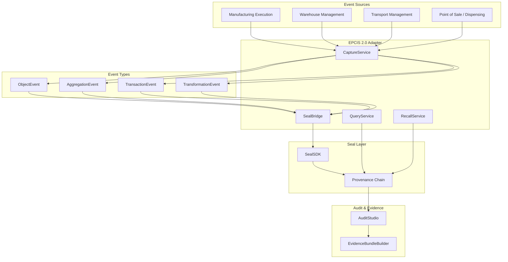

# Aethelred EPCIS 2.0 Implementation Guide

## Supply Chain Integration with Event Capture, Seal Binding, and Traceability

**Version:** 1.0  
**Last Updated:** April 2026  
**Classification:** Public -- Procurement-Ready

---

## 1. Overview

Aethelred integrates with GS1 EPCIS 2.0 (Electronic Product Code Information Services) through the supply chain adapter (`pkg/integrations/epcis`). The adapter provides full EPCIS 2.0 event type support, Core Business Vocabulary (CBV 2.0) compliance, cryptographic seal binding for event integrity, provenance chain construction across custody events, and automated recall workflows.

---

## 2. Architecture



---

## 3. EPCIS 2.0 Event Types

### 3.1 Supported Event Types

The adapter supports all four EPCIS 2.0 core event types defined in `pkg/integrations/epcis/events.go`:

| Event Type | Constant | Description | Typical Use |
|---|---|---|---|
| **ObjectEvent** | `EventTypeObject` | A specific object observed at a location | Commissioning, shipping, receiving, storing |
| **AggregationEvent** | `EventTypeAggregation` | Objects aggregated or disaggregated | Packing, unpacking, palletizing |
| **TransactionEvent** | `EventTypeTransaction` | Business transaction involving objects | Purchase orders, invoicing, delivery |
| **TransformationEvent** | `EventTypeTransformation` | Input objects transformed into output objects | Manufacturing, processing, combining |

### 3.2 Action Types

| Action | Constant | Description |
|---|---|---|
| **ADD** | `ActionADD` | Objects added to the event context |
| **OBSERVE** | `ActionOBSERVE` | Objects observed without state change |
| **DELETE** | `ActionDELETE` | Objects removed from the event context |

### 3.3 EPCIS Event Structure

```
EPCISEvent
├── EventType: ObjectEvent | AggregationEvent | TransactionEvent | TransformationEvent
├── Action: ADD | OBSERVE | DELETE
├── EventTime: time.Time                    -- when the event occurred
├── RecordTime: time.Time                   -- when the event was recorded
├── EventTimeZoneOffset: string             -- timezone offset
├── EPCList: []string                       -- EPC identifiers (SGTIN, SSCC, GRAI)
├── ParentID: string                        -- parent container (aggregation)
├── ChildEPCs: []string                     -- child items (aggregation)
├── InputEPCs: []string                     -- transformation inputs
├── OutputEPCs: []string                    -- transformation outputs
├── BizStep: string                         -- business step (CBV vocabulary)
├── Disposition: string                     -- business state (CBV vocabulary)
├── ReadPoint: string                       -- location where event was observed
├── BizLocation: string                     -- location of business activity
├── BizTransactionList: []BizTransaction    -- associated business transactions
├── SourceList: []Source                    -- source locations/parties
├── DestinationList: []Destination          -- destination locations/parties
├── SensorElementList: []SensorElement      -- IoT sensor data
├── Extensions: map[string]interface{}      -- vendor extensions
└── SealID: string                          -- Aethelred seal reference
```

---

## 4. Core Business Vocabulary (CBV 2.0)

### 4.1 Business Step Constants

The adapter provides CBV 2.0 business step constants:

| Constant | URN | Description |
|---|---|---|
| `BizStepCommissioning` | `urn:epcglobal:cbv:bizstep:commissioning` | Initial creation/serialization |
| `BizStepShipping` | `urn:epcglobal:cbv:bizstep:shipping` | Transfer to carrier |
| `BizStepReceiving` | `urn:epcglobal:cbv:bizstep:receiving` | Receipt from carrier |
| `BizStepStoring` | `urn:epcglobal:cbv:bizstep:storing` | Placement in storage |
| `BizStepPacking` | `urn:epcglobal:cbv:bizstep:packing` | Packaging operation |
| `BizStepUnpacking` | `urn:epcglobal:cbv:bizstep:unpacking` | Unpackaging operation |
| `BizStepTransforming` | `urn:epcglobal:cbv:bizstep:transforming` | Manufacturing transformation |
| `BizStepInspecting` | `urn:epcglobal:cbv:bizstep:inspecting` | Quality inspection |
| `BizStepDestroying` | `urn:epcglobal:cbv:bizstep:destroying` | Product destruction |

### 4.2 Disposition Constants

| Constant | URN | Description |
|---|---|---|
| `DispositionActive` | `urn:epcglobal:cbv:disp:active` | In active use/circulation |
| `DispositionInTransit` | `urn:epcglobal:cbv:disp:in_transit` | Being transported |
| `DispositionRetailed` | `urn:epcglobal:cbv:disp:retail_sold` | Sold to consumer |
| `DispositionRecalled` | `urn:epcglobal:cbv:disp:recalled` | Subject to recall |
| `DispositionDestroyed` | `urn:epcglobal:cbv:disp:destroyed` | Permanently destroyed |

---

## 5. CaptureService

### 5.1 Event Capture

```go
import "github.com/aethelred/aethelred/pkg/integrations/epcis"

captureService := epcis.NewCaptureService(epcis.CaptureConfig{
    ValidateEPCs:    true,   // validate EPC format
    ValidateBizStep: true,   // validate against CBV 2.0
    AutoSeal:        true,   // automatically seal each event
})

// Capture an ObjectEvent
event := epcis.EPCISEvent{
    EventType: epcis.EventTypeObject,
    Action:    epcis.ActionADD,
    EventTime: time.Now(),
    EPCList:   []string{"urn:epc:id:sgtin:0614141.107346.2017"},
    BizStep:   epcis.BizStepCommissioning,
    Disposition: epcis.DispositionActive,
    ReadPoint:  "urn:epc:id:sgln:0614141.00777.0",
    BizLocation: "urn:epc:id:sgln:0614141.00888.0",
}

result, err := captureService.CaptureEvent(ctx, event)
// result.SealID contains the seal reference
```

### 5.2 Validation

The CaptureService validates events before capture:

| Validation | Check | On Failure |
|---|---|---|
| EPC format | SGTIN, SSCC, GRAI, SGLN format validation | Reject event |
| Business step | CBV 2.0 vocabulary membership | Reject event |
| Disposition | CBV 2.0 disposition vocabulary | Reject event |
| Read point | SGLN format validation | Reject event |
| Business location | SGLN format validation | Reject event |
| Event type consistency | Action/event type compatibility | Reject event |
| Temporal consistency | Event time not in future | Reject event |

---

## 6. SealBridge

### 6.1 Event Sealing

The `SealBridge` binds each EPCIS event to an Aethelred Digital Seal:

```go
sealBridge := epcis.NewSealBridge(sealSDK, epcis.SealBridgeConfig{
    BuildProvenanceChain: true,
    RegulatoryConfig: sdk.RegulatoryConfig{
        ComplianceFrameworks: []string{"GS1-EPCIS", "FDA-FSMA"},
        RetentionPeriodDays:  730, // 2 years
        AuditRequired:        true,
    },
})

// Seal an event (called automatically if AutoSeal=true)
sealResult, err := sealBridge.SealEvent(ctx, event)
// sealResult.SealID: seal identifier
// sealResult.ContentHash: SHA-256 of canonical event JSON
// sealResult.ParentSealID: previous custody event seal
// sealResult.ProvenanceChainLength: chain depth
```

### 6.2 Provenance Chain Construction

The SealBridge automatically constructs provenance chains by linking seals:

```
Product Lifecycle Provenance Chain:

Commissioning Seal (depth 0)
    │ ← ObjectEvent(ADD, commissioning)
    │
Packing Seal (depth 1)
    │ ← AggregationEvent(ADD, packing)
    │
Shipping Seal (depth 2)
    │ ← ObjectEvent(OBSERVE, shipping)
    │
Receiving Seal (depth 3)
    │ ← ObjectEvent(OBSERVE, receiving)
    │
Storing Seal (depth 4)
    │ ← ObjectEvent(OBSERVE, storing)
    │
Dispensing Seal (depth 5)
    │ ← ObjectEvent(OBSERVE, retail_sold)

Each seal references its parent, creating
a cryptographically linked custody chain.
```

### 6.3 Transformation Lineage

For TransformationEvents, the SealBridge creates multi-parent lineage:

```
Input A Seal ─┐
              ├── Transformation Seal ── Output X Seal
Input B Seal ─┘                       └─ Output Y Seal

The transformation seal references all input seals,
and all output seals reference the transformation seal.
```

---

## 7. QueryService

### 7.1 EPCIS 2.0 Query Interface

```go
queryService := epcis.NewQueryService(epcis.QueryConfig{
    VerifySeals: true, // verify seal integrity on every query result
})

// SimpleEventQuery
results, err := queryService.Query(ctx, epcis.SimpleEventQuery{
    EPCList:       []string{"urn:epc:id:sgtin:0614141.107346.2017"},
    EventType:     epcis.EventTypeObject,
    BizStep:       epcis.BizStepShipping,
    TimeRange:     epcis.TimeRange{Start: startTime, End: endTime},
    ReadPoint:     "urn:epc:id:sgln:0614141.00777.0",
    MaxResults:    100,
    OrderBy:       "eventTime",
    OrderDirection: "ASC",
})

// Each result includes seal verification status
for _, event := range results.Events {
    fmt.Printf("Event: %s, Seal: %s, Verified: %v\n",
        event.EventType, event.SealID, event.SealVerified)
}
```

### 7.2 Traceability Queries

```go
// Trace forward (tracking): where did this product go?
forwardTrace, err := queryService.TraceForward(ctx, "urn:epc:id:sgtin:0614141.107346.2017")

// Trace backward (tracing): where did this product come from?
backwardTrace, err := queryService.TraceBackward(ctx, "urn:epc:id:sgtin:0614141.107346.2017")

// Full provenance chain
chain, err := queryService.GetProvenanceChain(ctx, sealID)
// chain contains ordered list of custody events with seals
```

---

## 8. RecallService

### 8.1 Recall Workflow

```go
recallService := epcis.NewRecallService(epcis.RecallConfig{
    AutoTrace:        true,  // automatically trace affected products
    NotifyPartners:   true,  // generate partner notifications
    GenerateEvidence: true,  // create evidence packages
})

// Initiate a recall
recall, err := recallService.InitiateRecall(ctx, epcis.RecallRequest{
    TriggerType: "quality_issue",
    AffectedEPCs: []string{
        "urn:epc:id:sgtin:0614141.107346.2017",
        "urn:epc:id:sgtin:0614141.107346.2018",
    },
    Severity:    epcis.RecallSeverityClassI,
    Description: "Potential contamination detected in lot XYZ",
    Initiator:   "quality-team@manufacturer.example",
})
```

### 8.2 Recall Lifecycle

```
RecallStatus:
    initiated       → Recall request received, trace started
    tracing         → Provenance chain traversal in progress
    assessed        → Affected scope determined
    notifying       → Trading partner notifications sent
    in_progress     → Recall actions underway
    completed       → All affected products accounted for
    closed          → Regulatory closure received
```

### 8.3 Recall Evidence Package

```
recall-evidence/
├── recall-request.json         # Original recall trigger
├── provenance-chains/          # Provenance chain for each affected EPC
│   ├── sgtin-2017.json
│   └── sgtin-2018.json
├── affected-products.json      # Complete affected product list
├── distribution-map.json       # Where products were distributed
├── notifications/              # Partner notification records
│   ├── distributor-a.json
│   └── retailer-b.json
├── evidence-bundle.json        # Compliance evidence bundle
└── package-seal.json           # Seal over entire package
```

---

## 9. Regulatory Compliance

### 9.1 GS1 EPCIS 2.0

| EPCIS 2.0 Requirement | Implementation Status |
|---|---|
| All 4 event types | Full -- ObjectEvent, AggregationEvent, TransactionEvent, TransformationEvent |
| CBV 2.0 vocabulary | Full -- Business steps, dispositions |
| Event capture interface | Full -- CaptureService with validation |
| Event query interface | Full -- QueryService with SimpleEventQuery |
| Sensor data support | Full -- SensorElementList on events |
| JSON/JSON-LD format | Full -- Canonical JSON serialization |
| REST binding | Full -- HTTP REST API for capture and query |

### 9.2 FDA FSMA Section 204

| FSMA 204 Requirement | Aethelred Implementation |
|---|---|
| Key Data Elements (KDEs) | Mapped to EPCIS event fields |
| Critical Tracking Events (CTEs) | Mapped to EPCIS business steps |
| Traceability Lot Code | SGTIN/SSCC identifiers in EPC lists |
| One-step-up, one-step-down | TraceForward/TraceBackward queries |
| Records within 24 hours | Automated evidence bundle generation |
| Sortable, searchable | QueryService with multi-field filtering |
| Electronic records | Full electronic capture with seal integrity |

### 9.3 EU Falsified Medicines Directive

| EU FMD Requirement | Aethelred Implementation |
|---|---|
| Unique identifier serialization | SGTIN identifiers per event |
| Anti-tampering verification | Digital Seal integrity checking |
| End-to-end verification | Provenance chain with seal at each step |
| Decommissioning | ObjectEvent with ActionDELETE |
| Alert management | RecallService notification workflow |

---

## 10. Performance and Scale

| Operation | Latency | Throughput |
|---|---|---|
| Event capture + seal | < 1s | 1,000+ events/second |
| Event query (single EPC) | < 100ms | 10,000+ queries/second |
| Provenance chain (10 hops) | < 2s | Including seal verification |
| Recall trace (10,000 items) | < 30s | Full provenance traversal |
| Evidence bundle generation | < 10s | Including control mappings |

### Storage Requirements

| Data Type | Size per Unit | Retention |
|---|---|---|
| EPCIS event record | 1-5 KB | Per regulatory requirement |
| Event seal | ~500 bytes | Matches event retention |
| Provenance chain link | ~200 bytes | Matches event retention |
| Recall evidence package | 50 KB - 5 MB | Per recall, minimum 3 years |
