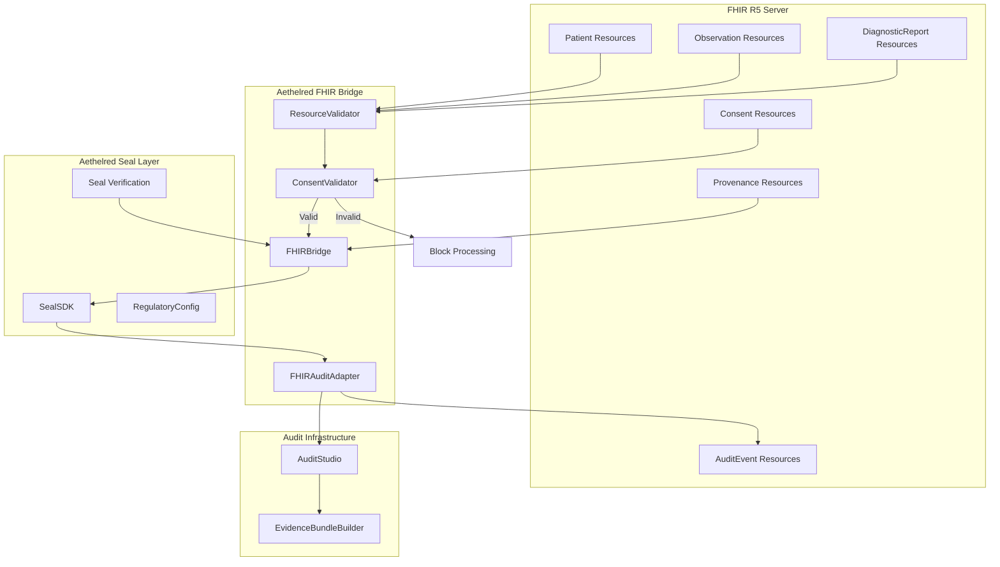
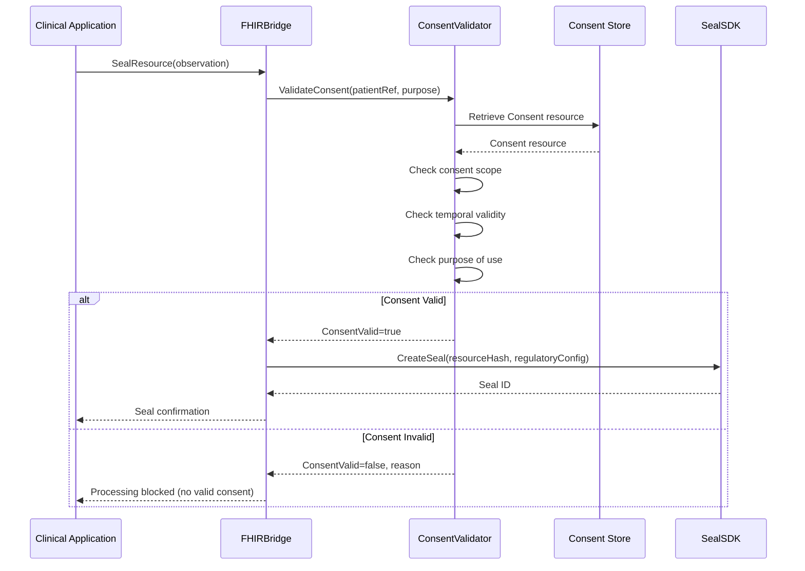

# Aethelred FHIR R5 Implementation Guide

## Healthcare Integration with FHIR Resource Mapping, Consent Flows, and Audit Events

**Version:** 1.0  
**Last Updated:** April 2026  
**Classification:** Public -- Procurement-Ready

---

## 1. Overview

Aethelred integrates with FHIR R5 (Fast Healthcare Interoperability Resources, Release 5) through the FHIR adapter (`pkg/integrations/fhir`). The `FHIRBridge` provides bidirectional conversion between FHIR R5 resources and Aethelred Digital Seals, enabling healthcare systems to seal clinical data with cryptographic integrity guarantees, validate consent before PHI processing, and generate FHIR-native audit events.

---

## 2. Architecture



---

## 3. FHIRBridge Configuration

The `FHIRBridge` is the primary integration point between FHIR R5 servers and the Aethelred platform.

### 3.1 BridgeConfig

```go
import "github.com/aethelred/aethelred/pkg/integrations/fhir"

config := fhir.BridgeConfig{
    // FHIR server base URL
    Endpoint: "https://fhir-server.internal:8443/fhir",
    
    // Bearer token for FHIR server authentication
    AuthToken: os.Getenv("FHIR_AUTH_TOKEN"),
    
    // Default jurisdiction for resources without explicit jurisdiction
    DefaultJurisdiction: "US",
    
    // CRITICAL: When true, consent validation is mandatory
    // before any patient-related resource can be sealed
    ConsentRequired: true,
    
    // Default data retention period (HIPAA minimum: 6 years)
    DefaultRetentionDays: 2190,
}

bridge := fhir.NewFHIRBridge(sealSDK, config)
```

### 3.2 Initialization

```go
// Initialize with SealSDK for blockchain anchoring
sealConfig := sdk.Config{
    NetworkEndpoint: "grpc://aethelred-node:9090",
    ChainID:         "aethelred-1",
    SignerAddress:    "aethelred1abc...",
    DefaultRegulatoryInfo: &sdk.RegulatoryConfig{
        DataClassification:       "phi",
        ComplianceFrameworks:     []string{"HIPAA", "NIST-AI-RMF"},
        JurisdictionRestrictions: []string{"US"},
        RetentionPeriodDays:      2190,
        AuditRequired:            true,
    },
}

sealSDK := sdk.NewSealSDK(sealConfig)
bridge := fhir.NewFHIRBridge(sealSDK, bridgeConfig)
```

---

## 4. FHIR Resource Mapping

### 4.1 Supported Resources

| FHIR R5 Resource | Bridge Operation | Seal Type | Consent Required |
|---|---|---|---|
| **Patient** | `SealResource` / `VerifyResource` | Identity seal with demographic hash | Yes |
| **Observation** | `SealResource` / `VerifyResource` | Clinical data seal with value hash | Yes |
| **DiagnosticReport** | `SealResource` / `VerifyResource` | Report seal with content hash | Yes |
| **Consent** | `SealResource` / `VerifyResource` | Consent seal with scope and period | No (self-referential) |
| **AuditEvent** | Generated by `FHIRAuditAdapter` | Generated as output, not sealed separately | No |
| **Provenance** | `SealResource` / `VerifyResource` | Provenance seal mapping to seal chain | Yes |
| **DocumentReference** | `SealResource` / `VerifyResource` | Document seal with attachment hash | Yes |
| **Condition** | `SealResource` / `VerifyResource` | Condition seal with clinical data hash | Yes |
| **MedicationRequest** | `SealResource` / `VerifyResource` | Prescription seal with medication hash | Yes |

### 4.2 Resource-to-Seal Conversion

The `FHIRBridge.SealResource()` method converts a FHIR resource to an Aethelred Digital Seal:

```
FHIR Resource                         Aethelred Digital Seal
├── resourceType                  →   ContentType metadata
├── id                            →   Cross-reference (sealStore mapping)
├── meta.versionId                →   Seal version tracking
├── meta.lastUpdated              →   Seal timestamp
├── Full resource JSON            →   ContentHash (SHA-256 of canonical JSON)
├── meta.security[]               →   RegulatoryConfig.DataClassification
├── meta.tag[]                    →   Seal metadata tags
└── Patient reference             →   Consent validation trigger
```

### 4.3 Seal-to-Resource Verification

The `FHIRBridge.VerifyResource()` method verifies a FHIR resource against its seal:

```
Verification Process:
1. Retrieve seal by resource ID (via sealStore mapping)
2. Serialize current resource to canonical JSON
3. Compute SHA-256 of canonical JSON
4. Compare with seal ContentHash
5. Verify seal blockchain anchor via SealSDK.VerifySeal()
6. Return verification result:
   ├── ContentMatch: bool (hash comparison)
   ├── SealValid: bool (blockchain verification)
   ├── ConsentValid: bool (current consent status)
   └── Timestamp: verification time
```

---

## 5. Consent Management

### 5.1 Consent Validation Flow



### 5.2 Consent Resource Structure

The ConsentValidator expects FHIR R5 Consent resources with:

```
FHIR Consent Resource
├── status: active | inactive | entered-in-error
├── scope: patient-privacy | research | treatment
├── category: HIPAA consent category
├── patient: Reference(Patient)
├── dateTime: consent date
├── period:
│   ├── start: consent effective date
│   └── end: consent expiration date
├── grantor: who granted consent
├── provision:
│   ├── type: permit | deny
│   ├── period: provision validity
│   ├── actor[]: authorized actors
│   ├── action[]: permitted actions
│   ├── purpose[]: purposes of use
│   └── dataPeriod: data time range
└── sourceAttachment | sourceReference: consent document
```

### 5.3 Consent Validation Checks

| Check | Description | Failure Action |
|---|---|---|
| **Existence** | Valid Consent resource exists for the patient | Block processing |
| **Status** | Consent status is `active` | Block processing |
| **Period** | Current time within consent period (start/end) | Block processing |
| **Purpose** | Requested purpose matches consent purpose codes | Block processing |
| **Scope** | Operation within consent scope | Block processing |
| **Actor** | Requesting party authorized by consent | Block processing |
| **Data Period** | Requested data within consent data period | Block processing |

### 5.4 Consent Revocation

```go
// Consent revocation triggers:
// 1. All future processing for affected patient resources is blocked
// 2. Existing seals annotated with revocation metadata
// 3. Revocation event recorded in audit trail
// 4. GDPR erasure workflow triggered if applicable

bridge.HandleConsentRevocation(ctx, fhir.RevocationEvent{
    ConsentID:  "Consent/456",
    PatientRef: "Patient/123",
    RevokedAt:  time.Now(),
    Reason:     "patient_request",
})
```

---

## 6. Audit Event Generation

### 6.1 FHIRAuditAdapter

The `FHIRAuditAdapter` generates FHIR R5 AuditEvent resources for every operation on patient data, bridging between FHIR audit requirements and Aethelred's audit infrastructure.

### 6.2 FHIR AuditEvent Mapping

```
Aethelred Audit Record              FHIR R5 AuditEvent
├── Category                    →   type.code
├── Sub-category                →   subtype[].code
├── Timestamp                   →   recorded
├── Result                      →   outcome.code
├── Actor identity              →   agent[].who
├── System identifier           →   source.observer
├── Resource reference          →   entity[].what
├── Role                        →   entity[].role
└── Additional evidence         →   extension[]
```

### 6.3 Generated AuditEvent Types

| Operation | AuditEvent Type | Subtype | Outcome Codes |
|---|---|---|---|
| Resource sealing | `rest` | `create` | 0 (Success), 4 (Minor failure), 8 (Serious failure) |
| Resource verification | `rest` | `read` | 0 (Success), 4 (Integrity mismatch) |
| Consent validation | `security` | `consent-check` | 0 (Consent valid), 4 (Consent invalid) |
| Consent revocation | `security` | `consent-revoke` | 0 (Revocation processed) |
| PHI access | `rest` | `read` | 0 (Authorized), 8 (Unauthorized) |
| Evidence bundle export | `system` | `export` | 0 (Export successful) |

### 6.4 Dual Audit Trail

Every operation produces both:

1. **FHIR AuditEvent** -- persisted to the FHIR server, queryable by FHIR-native tools
2. **Aethelred Audit Record** -- persisted to the hash-chained audit log via AuditStudio, part of the evidence bundle

This dual-write ensures both HIPAA audit requirements (via FHIR) and cross-framework compliance (via Aethelred) are satisfied.

---

## 7. Integration Patterns

### 7.1 EHR Integration

```
Electronic Health Record (EHR)
    │
    ├── FHIR R5 REST API
    │   ├── POST /Patient        → Bridge.SealResource()
    │   ├── POST /Observation    → Bridge.SealResource()
    │   ├── POST /DiagnosticReport → Bridge.SealResource()
    │   ├── GET  /Patient/{id}   → Bridge.VerifyResource()
    │   └── POST /Consent        → Bridge.SealResource()
    │
    └── Subscription / Event
        ├── resource-created     → Auto-seal new resources
        ├── resource-updated     → Re-seal with version tracking
        └── consent-revoked      → HandleConsentRevocation()
```

### 7.2 Clinical Decision Support Integration

```
Clinical Decision Support System
    │
    ├── Input: FHIR Observations, Conditions
    │   └── Each input sealed via Bridge.SealResource()
    │       └── Consent validated before processing
    │
    ├── Processing: AI inference
    │   └── PolicyEngine.Evaluate() with healthcare template
    │       └── RequireApproval for clinical decisions
    │
    └── Output: DiagnosticReport, RiskAssessment
        └── Output sealed with input provenance
            └── Evidence bundle generated
```

### 7.3 Research Data Sharing

```
Research Data Request
    │
    ├── ConsentValidator checks research consent scope
    ├── Data de-identification (organizational process)
    ├── De-identified resources sealed
    ├── Research provenance chain created
    └── Evidence bundle for IRB review
```

---

## 8. HIPAA Compliance Mapping

| HIPAA Requirement | FHIR Bridge Implementation | Evidence |
|---|---|---|
| 164.308(a)(1) -- Security Management | PolicyEngine + AuditStudio | Policy records, monitoring logs |
| 164.308(a)(3) -- Workforce Security | ConsentValidator actor checks | Access authorization records |
| 164.308(a)(4) -- Information Access | Role-based policy evaluation | Access control decisions |
| 164.312(a) -- Access Control | ConsentValidator + PolicyEngine | Consent validation + policy decision records |
| 164.312(b) -- Audit Controls | FHIRAuditAdapter + AuditStudio | FHIR AuditEvents + hash-chained audit log |
| 164.312(c) -- Integrity | Digital Seals on all PHI resources | Seal verification results |
| 164.312(d) -- Authentication | Agent DID-based identity | Identity attestation records |
| 164.312(e) -- Transmission Security | TLS + sovereign deployment | Transport configuration records |
| 164.502(b) -- Minimum Necessary | Resource-level consent validation | Purpose-of-use records per access |
| 164.508 -- Consent | ConsentValidator with mandatory consent | Consent validation records per operation |
| 164.524 -- Access to PHI | FHIR resource query + provenance chain | Access records, provenance chains |
| 164.528 -- Accounting of Disclosures | FHIRAuditAdapter records all disclosures | Disclosure AuditEvent records |

---

## 9. Performance Characteristics

| Operation | Latency | Notes |
|---|---|---|
| Consent validation | < 20ms | Cached consent store; cache invalidated on revocation |
| Resource sealing | < 500ms | Includes canonical JSON serialization, hashing, seal creation |
| Resource verification | < 200ms | Hash comparison + blockchain verification |
| AuditEvent generation | < 10ms | Async write to FHIR server and AuditStudio |
| Evidence bundle | < 3s | Includes control mapping generation |

---

## 10. Deployment Requirements

| Requirement | Specification |
|---|---|
| FHIR Server | R5 compliant (HAPI FHIR 7.x+, Microsoft FHIR Server, or equivalent) |
| Authentication | OAuth 2.0 / SMART on FHIR recommended |
| HSM | FIPS 140-2 Level 3 recommended for PHI seal signing keys |
| Network | TLS 1.3 between all components; sovereign boundary for PHI zone |
| Storage | Minimum 6 years retention for HIPAA (configurable via DefaultRetentionDays) |
| Consent Store | High-availability consent resource store with < 20ms read latency |
